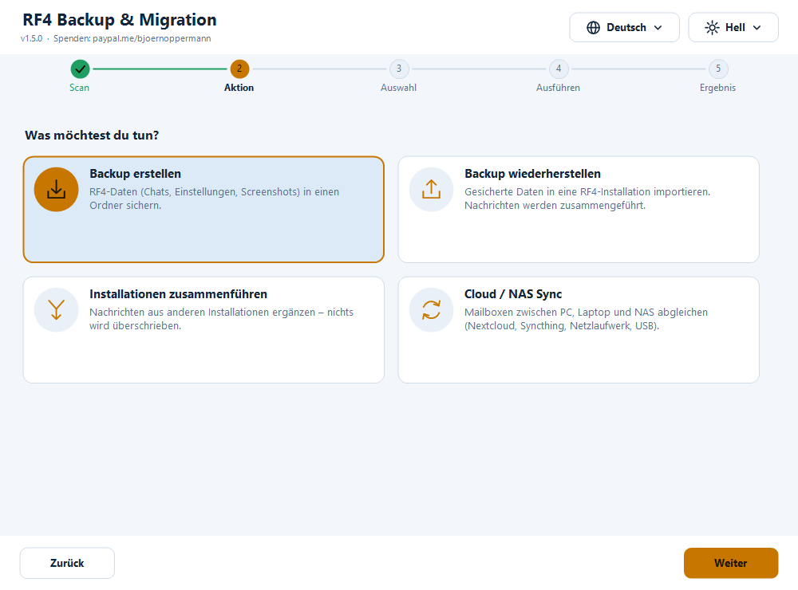
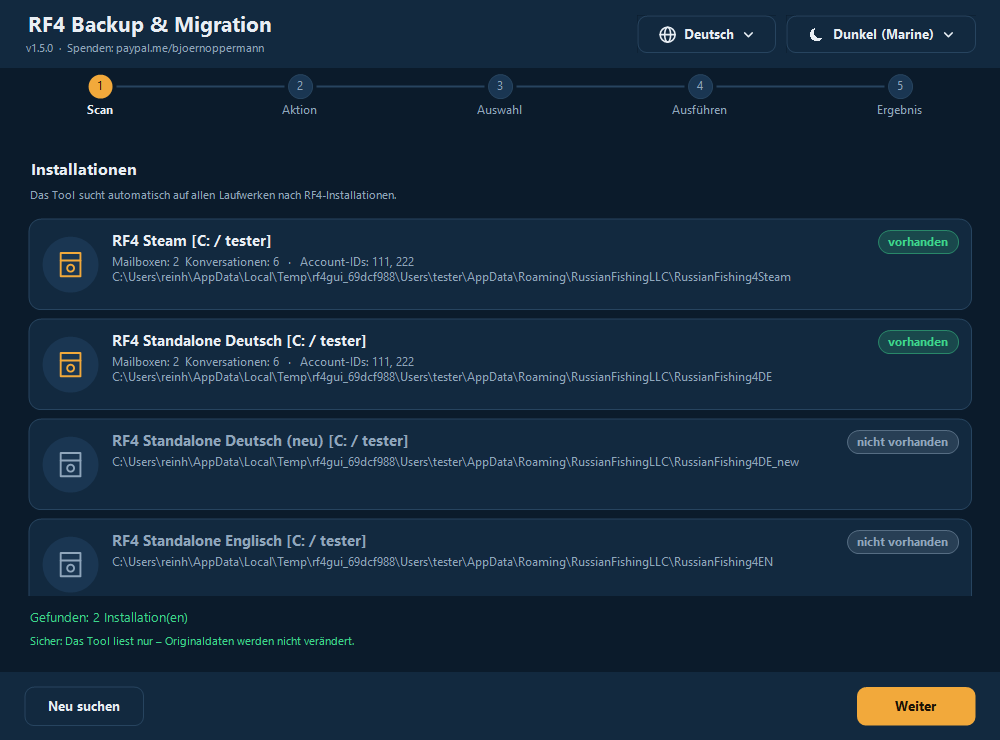
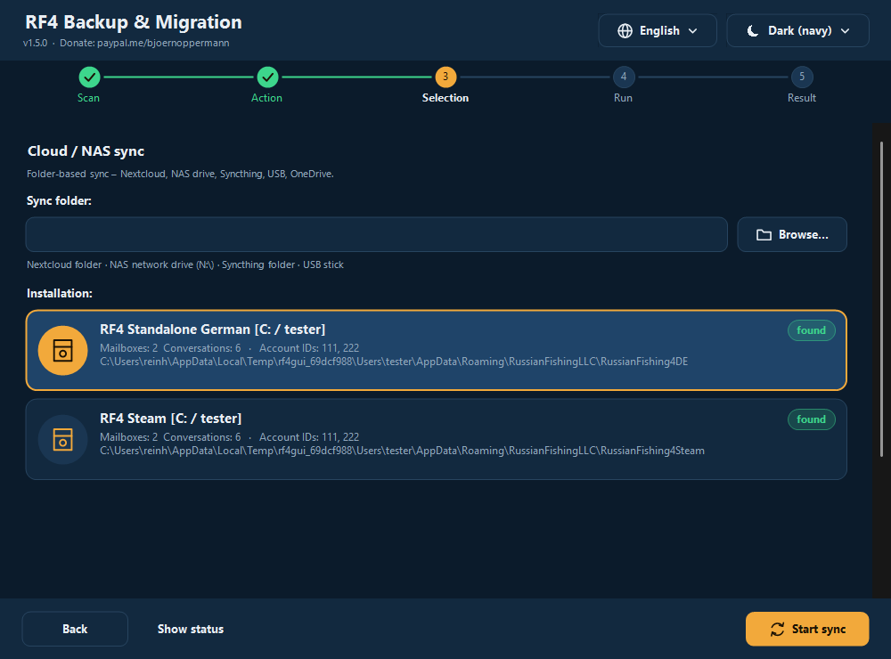

# RF4 — Backup & Migration Tool

[Deutsch](README.md) · **English** · [中文](README.zh.md) · [Русский](README.ru.md)

Free tool to **back up, restore, merge and synchronize** your *Russian Fishing 4* player data: in-game mailboxes (chats), settings and screenshots.
For **Windows** (graphical interface + terminal, PowerShell) and **Linux/macOS** (bash).

- 🌍 **Four languages, fully switchable:** German · English · 中文 · Русский — more languages can be added as a plain text file
- 🎨 **Dark and light, automatic** (follows Windows, or choose manually) — more themes can be added as a text file
- 🖥️ **Crisp at any display scaling** (100 % … 200 %, multiple monitors)
- 🛡️ **Nothing is ever deleted.** Files that get replaced are first copied to an undo folder
- 🔍 Finds **Standalone, Steam, Wine, Proton**, other users and other drives automatically



📄 Guide & blog: [nga.li/rf4b](https://nga.li/rf4b) · 📥 Download: [nga.li/rf4dl](https://nga.li/rf4dl) · 💻 Source: [nga.li/rf4git](https://nga.li/rf4git)

## Quick start

1. **Old PC:** start the program → **Create backup** → choose the source → *Start backup*.
2. Move the backup folder (default `C:\Users\<name>\RF4_Backup`) to the new PC (USB stick, NAS, cloud). Start RF4 there **once and close it**.
3. **New PC:** start the program → **Restore backup** → pick your backup from the list → choose the target installation → *Start restore*.

Progress, inventory and tackle live on the RF4 servers and are available automatically. This tool handles what is stored **locally**: chats, settings, screenshots.

## Installation

| Option | How |
|---|---|
| **Installer** `rf4sa-backup-full-setup-v1.5.0.exe` (recommended) | Double-click. Creates Start-menu entries (GUI, terminal, **uninstall**). No admin rights needed. |
| GUI only / terminal only installers | same |
| **No installer** | Right-click `rf4sa-backup-gui.ps1` → **Run with PowerShell** |
| **Linux / macOS** | `bash rf4sa-backup.sh` (needs bash ≥ 4 and `python3`) |

Windows needs Windows PowerShell 5.1 (preinstalled on Windows 10/11). Python is **not** needed on Windows.
If scripts are blocked: `powershell -ExecutionPolicy Bypass -File rf4sa-backup-gui.ps1`.

## The graphical interface

Five steps: **Scan → Action → Selection → Run → Result**. Top right: **language** (🌐) and **theme** (☀/☾) — the interface switches instantly.



- **Create backup:** pick source, tick what to save (mailboxes, Settings.dat, Preferences.dat, Crafting.dat, screenshots), optionally only one account, choose the target folder.
- **Restore backup:** the list shows all **existing backups** (default folder, previously used folders and their subfolders) with contents, size and date — newest first. *Choose another folder…* picks one from elsewhere (e.g. a USB stick). Everything contained in the backup is ticked automatically.
- **Merge installations:** choose the target and one or more sources; only missing messages are added.
- **Cloud/NAS sync:** choose a shared folder (Nextcloud, Syncthing, NAS, USB …) and the installation.
- **Result:** key figures (messages added, conversations, files copied, screenshots, skipped, errors); *Show details* expands the full log.



**Theme:** *Automatic (like Windows)* is the default — switch Windows between light and dark and the program follows **immediately**, even while running.
**DPI:** per-monitor aware; text and icons are drawn natively, not scaled up.

## The terminal program

```powershell
powershell -ExecutionPolicy Bypass -File rf4sa-backup.ps1 [-Lang de|en|zh|ru|custom]
bash rf4sa-backup.sh [-l xx]          # Linux / macOS
```

Numbered menus; multi-select: toggle numbers, `a` = all, `n` = none, `Enter` = continue, `0` = back. **Restore** offers existing backups as a list. A summary with key figures follows every action. Box-drawing is aligned even with 中文 (double-width aware); `RF4_ASCII=1` gives plain ASCII.

## Features in detail

- **Merge:** deduplicates by message ID (`meta.id`), inserts new messages by time (`meta.created`). A file is **only written if there really are new messages**, via a temp file that replaces the original only after a successful read-back check. The original is copied to the undo folder first.
- **Sync:** (1) local → sync folder (merge), (2) sync folder → local (merge), (3) settings files: the **newer** file wins.
- **Undo folder:** `<installation>\_rf4tool_undo\<date_time>\…`. Copy a file back to undo a change. The program never deletes it.
- **Safety:** scan and backup only read. RF4 running? → warning (close the game before restore/merge/sync). No network access, no telemetry.
- RF4 only officially allows switching **Steam → Standalone**, not the other way ([nga.li/rf4transfer](https://nga.li/rf4transfer)).

## Languages and themes (add your own)

Everything is modular — plain text files, picked up automatically at start, no rebuild needed.

**Language:** copy [`examples/template.lang`](examples/template.lang) to `%APPDATA%\rf4-backup\lang\pt.lang` (or a `lang\` folder next to the script; Linux: `~/.config/rf4-backup/lang/pt.lang`), set `@code=pt` and `@name=Português`, translate the text right of `=`. **Missing lines fall back to English**, so partial translations work. Keep placeholders `{0}`, `{1}`. UTF-8.

**Theme:** copy [`examples/template.theme`](examples/template.theme) to `%APPDATA%\rf4-backup\themes\<name>.theme` and adjust the `#RRGGBB` colours. `@base=dark|light` says which Windows mode it stands in for under “Automatic”. Unset colours come from the dark theme.

Built in: **Dark (navy)** with warm amber accent, and **Light**. Contrast ratios are verified by the tests.

## Where is my data?

```
%APPDATA%\RussianFishingLLC\<variant>\Mailbox_<AccountID>\*.dat       chats (JSON, UTF-8 with BOM)
%APPDATA%\RussianFishingLLC\<variant>\Settings.dat | Preferences.dat | Crafting.dat
Documents\Russian Fishing 4\Screenshots
```
Variants: `RussianFishing4DE`, `RussianFishing4DE_new`, `RussianFishing4EN`, `RussianFishing4Steam` (any other folder there is detected automatically). On Linux the same path lies inside the Wine/Proton prefix.
The tool itself stores only its settings in `%APPDATA%\rf4-backup\settings.json` (`~/.config/rf4-backup/settings.conf`).

## FAQ

- **No installation found?** RF4 must have been started at least once. Check that `%APPDATA%\RussianFishingLLC` exists; otherwise choose the target path manually in Restore.
- **My backup is not listed?** The list covers `RF4_Backup`, previously used folders and one level below. A folder counts as a backup if it contains `Mailbox_*` folders, one of the `.dat` files or a `Screenshots` folder. Use *Choose another folder…*.
- **No chats after restore?** RF4 must be closed during import. Import again (safe to repeat) or copy back from the undo folder. Check the account ID.
- **CJK/Cyrillic boxes in the terminal?** Use Windows Terminal. The GUI is not affected.
- **Steam Cloud overwrites files?** Possible with Steam installs; start Steam offline after a restore or pause cloud sync for the game.
- **Linux: no `python3`?** `sudo apt install python3` — only needed for merging JSON.

## Uninstall

Start menu → *RF4 Backup Tool* → **Uninstall RF4 Backup Tool** (or Windows Settings → Apps). Only program files are removed; you are asked whether to delete saved **settings** (language, theme, sync folder, your own language/theme files). **Your RF4 game data and your backups are never touched.** Without the installer: delete the files (and optionally `%APPDATA%\rf4-backup`).

## Environment variables

`RF4_LANG`, `RF4_ASCII=1`, `RF4_BACKUP_DIRS` (extra backup folders, `;` / `:` separated), `RF4_SCAN_USERS` (extra “Users” folders), `RF4_NO_DRIVE_SCAN=1`, `RF4_THEME_BASE=dark|light`, `RF4_GUI_SCALE`.

## Development

Sources in `src/` (`core.ps1`, `lang/*.lang`, `themes/*.theme`, `ui.cs`, `gui.ps1`, `cli.ps1`, `cli.sh`); `build.ps1` assembles the shipped single files.
Tests: `tests/Test-Core.ps1`, `tests/Test-Cli.ps1`, `tests/Test-Gui.ps1` (`powershell -STA`), `bash tests/test-sh.sh`. Installers: Inno Setup 6 (`installer/*.iss`).

## Changelog (short)

**1.5.0** new GUI (crisp, auto dark/light, language/theme menus, cards, progress, result figures), existing backups listed in Restore, modular languages/themes, nicer terminal/bash, uninstaller entry, more tests. **1.4.0** shared core, full translation, fixes (own installation was never found, crashes with single files, screenshot restore), undo folder.

MIT License · Donate: [paypal.me/bjoernoppermann](https://paypal.me/bjoernoppermann) · [Codeberg](https://codeberg.org/Natural78/rf4-backup-tool)
