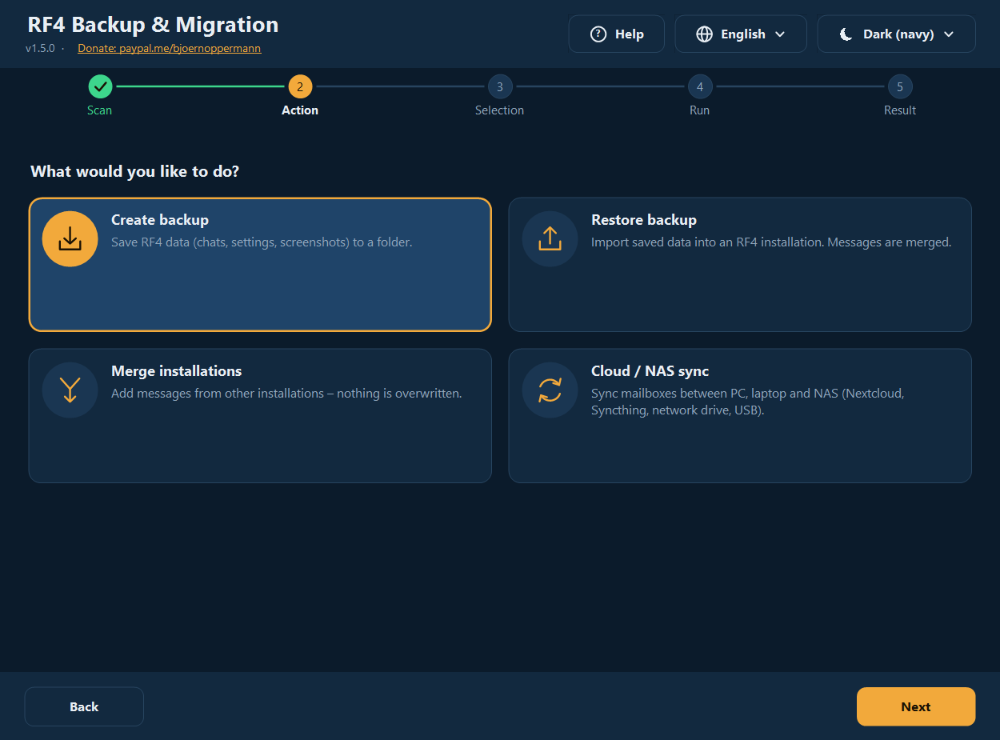
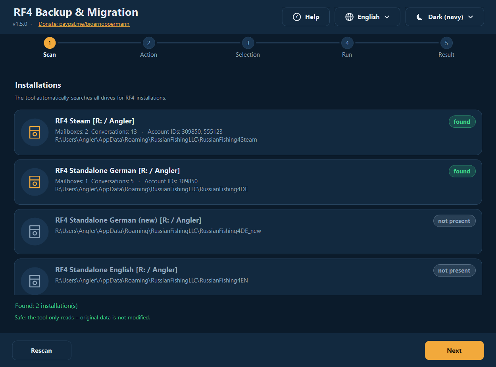
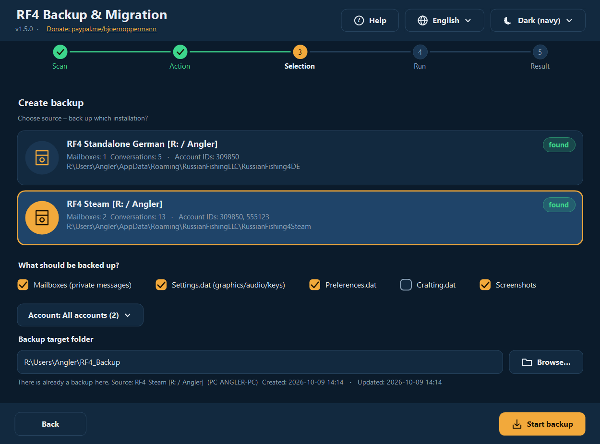
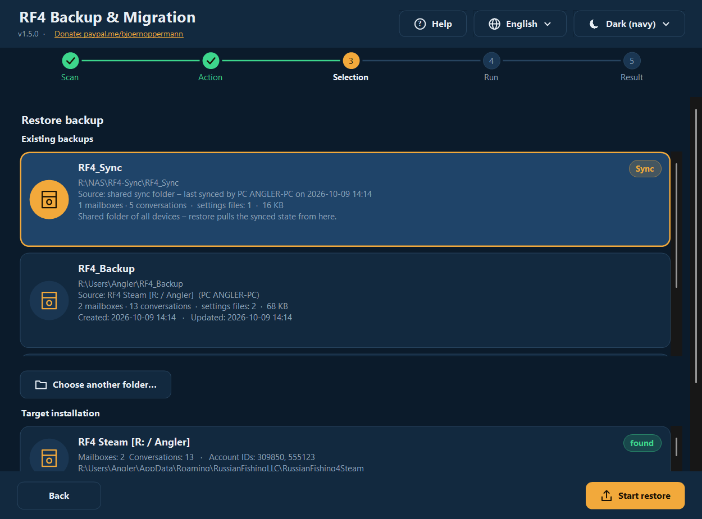
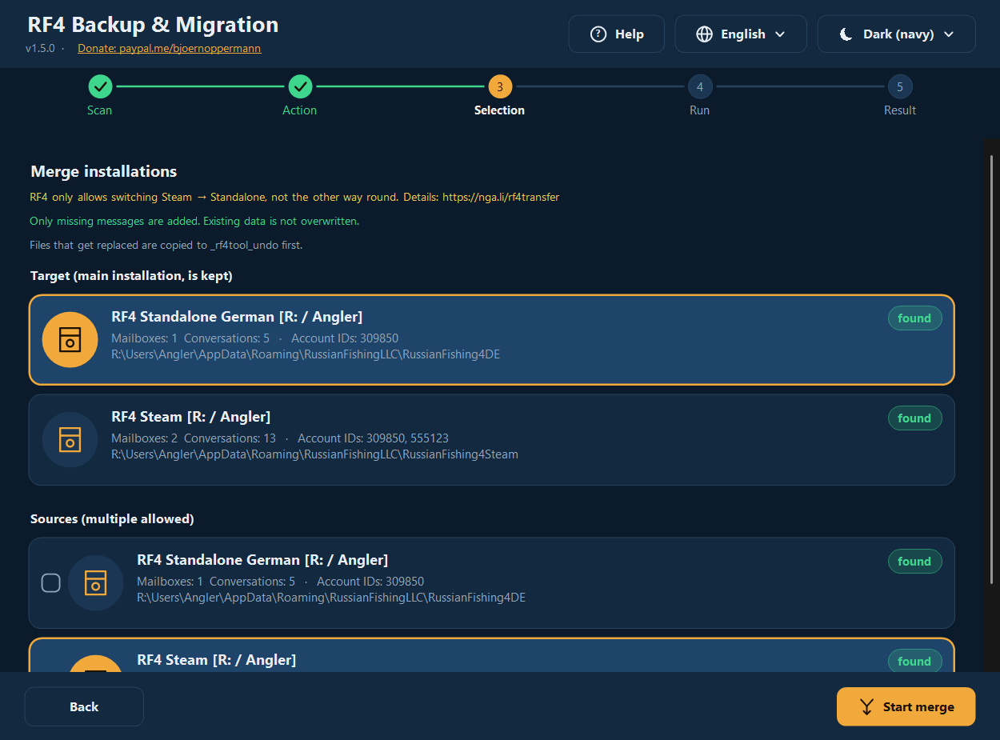
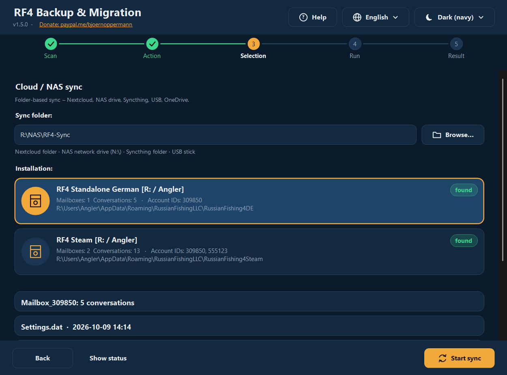
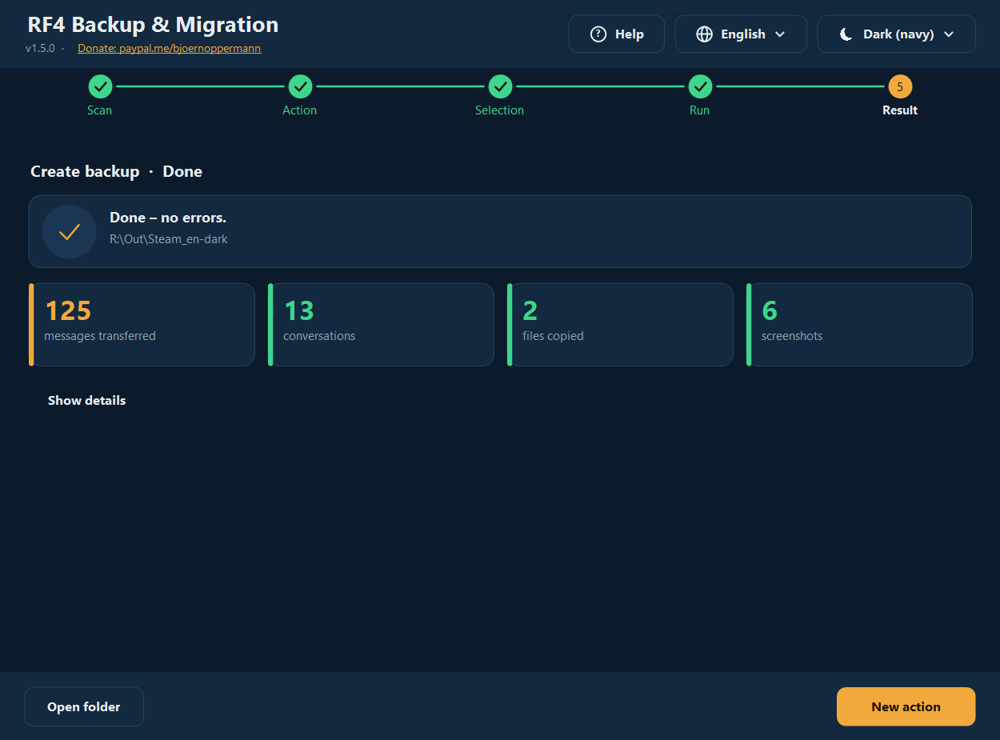
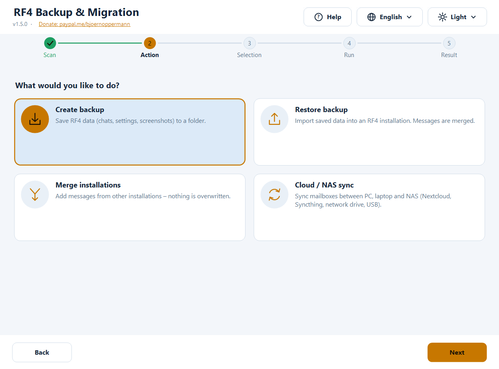
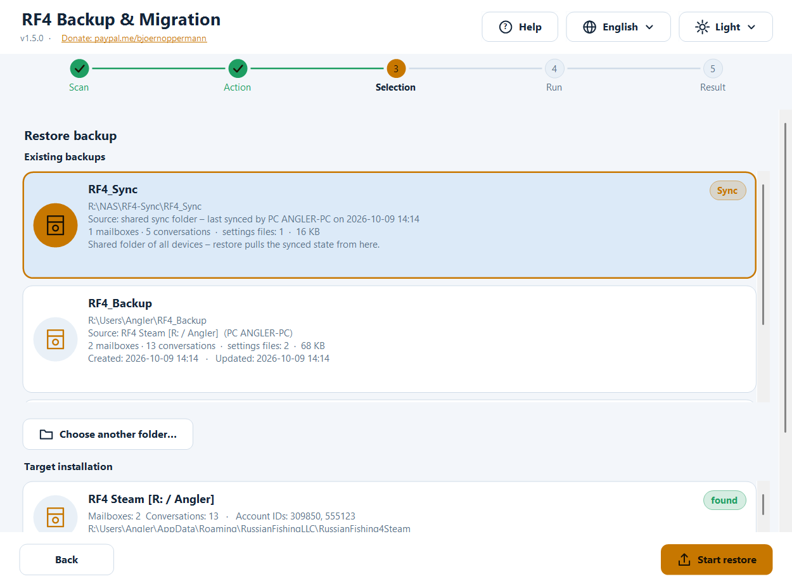
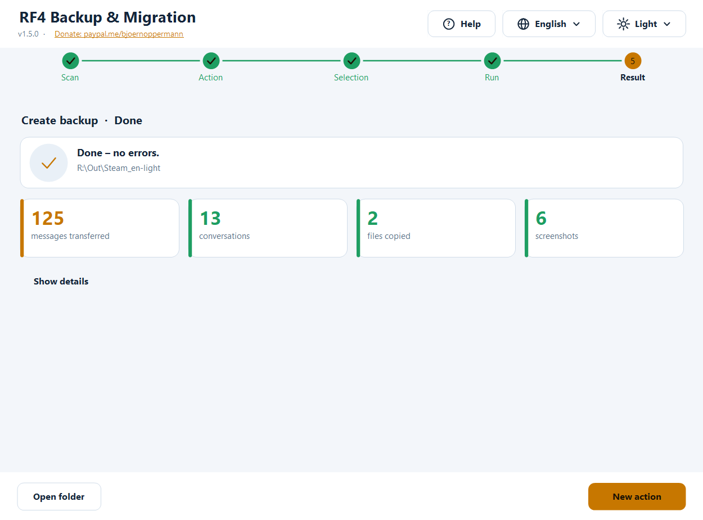

# RF4 — Backup & Migration Tool

[Deutsch](README.md) · **English** · [中文](README.zh.md) · [Русский](README.ru.md)

Free tool to **back up, restore, merge and synchronize** your *Russian Fishing 4* player data:
in-game mailboxes (chats), settings and screenshots. For **Windows** (graphical interface + terminal, PowerShell) and **Linux/macOS** (bash).

- 🌍 **Four languages, fully switchable:** German · English · 中文 · Русский — more languages can be added as a plain text file
- 🎨 **Dark and light, automatic** (follows Windows, or choose manually) — more themes can be added as a text file
- 🖥️ **Crisp at any display scaling** (100 % … 200 %, multiple monitors)
- 🛡️ **Nothing is ever deleted.** Files that get replaced are first copied to an undo folder
- 🔍 Finds **Standalone, Steam, Wine, Proton**, other users and other drives automatically
- 📍 Every backup knows **which installation it came from and when**; restoring also works **from the sync folder / NAS**
- ❓ A **help button** opens this guide (with screenshots) in the language of the program



📄 Guide & blog: [nga.li/rf4b](https://nga.li/rf4b) · 📥 Download: [nga.li/rf4dl](https://nga.li/rf4dl) · 💻 Source: [nga.li/rf4git](https://nga.li/rf4git)

---

## Contents

1. [Quick start](#quick-start)
2. [Installation](#installation)
3. [The graphical interface](#the-graphical-interface)
4. [The terminal program](#the-terminal-program)
5. [Features in detail](#features-in-detail)
6. [Languages and themes (add your own)](#languages-and-themes)
7. [Where is my data?](#where-is-my-data)
8. [Safety & verification](#safety--verification)
9. [FAQ & troubleshooting](#faq--troubleshooting)
10. [Uninstall](#uninstall)
11. [Settings, environment variables](#settings-environment-variables)
12. [Development, tests, build](#development-tests-build)
13. [Changelog](#changelog)

---

## Quick start

**Moving to a new PC or reinstalling in three steps:**

1. **Old PC:** start the program → **Create backup** → choose the source → *Start backup*.
2. Take the backup folder (default: `Users\<name>\RF4_Backup`) to the new PC via USB stick, NAS or cloud. Start RF4 there **once and close it**.
3. **New PC:** start the program → **Restore backup** → pick your backup from the list → choose the target installation → *Start restore*.

Progress, inventory and tackle live on the RF4 servers and are available on the new PC automatically. This tool takes care of what is stored **locally**: chats, settings, screenshots.

---

## Installation

| Option | For whom | How |
|---|---|---|
| **Installer** (`rf4sa-backup-full-setup-v1.5.0.exe`) | Windows, recommended | Double-click, next, done. Creates Start-menu entries (GUI, terminal, **guide with screenshots**, **uninstall**) plus a page with **clickable links** (donate, blog, download, source). No admin rights needed. |
| `rf4sa-backup-gui-setup-v1.5.0.exe` / `rf4sa-backup-cli-setup-v1.5.0.exe` | GUI only / terminal only | same as above |
| **No installer** | Windows | Right-click `rf4sa-backup-gui-v1.5.0.ps1` → **Run with PowerShell** |
| **Linux / macOS** | bash | `bash rf4sa-backup-v1.5.0.sh` (needs bash ≥ 4 and `python3`) |

All program files carry the **version in their name** (`rf4sa-backup-gui-v1.5.0.ps1`, `rf4sa-backup-v1.5.0.ps1`, `rf4sa-backup-v1.5.0.sh`), just like the installers. On update the installer replaces the older files.
Windows requirements: Windows PowerShell 5.1 (preinstalled on Windows 10/11; Windows 7 with WMF 5.1). Python is **not** needed on Windows.

> **Note “script execution disabled”:** When started with a right-click, Windows sets the execution policy automatically for that one start. If a message appears anyway:
> `powershell -ExecutionPolicy Bypass -File rf4sa-backup-gui-v1.5.0.ps1`

---

## The graphical interface

A step-by-step guide with five stations at the top: **Scan → Action → Selection → Run → Result**.
Top right you always find **Help** (❓), **Language** (🌐) and **Theme** (☀/☾). The interface switches instantly, no restart. The **help button** opens this guide offline in your browser — **in the language currently set in the program**, with matching screenshots.

### 1. Scan
The program searches for all RF4 installations: your own user, other users, all drives. Found ones are marked, possible (not yet existing) targets are greyed out. The list scrolls (mouse wheel, also directly over an entry).



### 2. Action
Four cards: Create backup · Restore backup · Merge installations · Cloud/NAS sync.


### 3. Selection

**Create backup:** choose the source, tick what to save (mailboxes, Settings.dat, Preferences.dat, Crafting.dat, screenshots), optionally only *one* account if there are several, pick the target folder. If a backup already lives there, a hint shows its source and date.



**Restore backup:** at the top you see all **existing backups** with contents, size, **source** (which installation, which PC) and **date** (created/updated) — newest first. Listed are the default folder, previously used folders, their subfolders and the **sync folder** (marked *Sync*). *Choose another folder…* takes a backup from elsewhere (USB stick, **network drive/NAS**); you may also pick the **parent** of the sync folder (the program finds `RF4_Sync` inside by itself). Then choose the target installation; everything the backup contains is ticked automatically.



**Merge:** choose the target (main installation) and tick one or more sources. Only missing messages are added.



**Cloud/NAS sync:** enter the sync folder (Nextcloud, Syncthing, NAS drive, USB …), choose the installation, *Start sync*. *Show status* lists what is already in the sync folder.



### 4./5. Run and result
While working, a progress bar shows the current line. Afterwards you see **key figures** (messages transferred, conversations, files copied, screenshots, skipped, errors). *Show details* expands the full log; *Open folder* opens the target in Explorer.



### Light and dark

**Theme:** *Automatic (like Windows)* is the default — switch Windows between light and dark mode and the program follows **immediately** (even while running). You can pick a fixed theme.





**Language:** on first start according to the Windows language, otherwise English; your choice is saved.
**Keyboard:** `Tab` moves between cards/buttons, `Space`/`Enter` selects.
**High-resolution monitors:** the program is DPI-aware (per-monitor v2) — text and icons are drawn natively, not scaled up. Moving the window to another monitor adapts everything.

---

## The terminal program

```powershell
powershell -ExecutionPolicy Bypass -File rf4sa-backup-v1.5.0.ps1            # language automatic
powershell -ExecutionPolicy Bypass -File rf4sa-backup-v1.5.0.ps1 -Lang zh   # fixed: de | en | zh | ru | custom
```

```
  ╔════════════════════════════════════════════════════════════╗
  ║ RF4 Backup & Migration   v1.5.0                            ║
  ║ RF4: nga.li/rf4de  ·  Blog: nga.li/rf4b                    ║
  ║ Donate: paypal.me/bjoernoppermann                          ║
  ╚════════════════════════════════════════════════════════════╝

   [1] Scan – Show all installations
   [2] Backup – Save data to a folder
   [3] Restore – Import from a backup
   [4] Merge – Combine installations
   [5] Sync – Synchronize with cloud/NAS
   [H] Help / guide
   [L] Change language  (English)
   [0] Exit
```

- Menus: type a number. Multi-select: toggle numbers (`1 3 4` or `1,3`), `a` = all, `n` = none, `Enter` = continue, `0` = back.
- **`[H]`** opens the guide (HTML with screenshots) in the current program language.
- **Restore** offers existing backups as a list (with path, source, contents, date; the sync folder is marked `[Sync]`) or manual path entry — UNC paths such as `\\NAS\rf4\RF4_Sync` work too.
- After every action a **summary** with key figures follows.
- Box drawing and symbols are Unicode and stay aligned even with 中文 (double width is taken into account). `RF4_ASCII=1` gives plain ASCII (for old consoles/logs).
- For 中文 use **Windows Terminal** (the classic console may show boxes depending on the font).

**Linux / macOS:**

```bash
bash rf4sa-backup-v1.5.0.sh            # language automatic (LANG), or:
bash rf4sa-backup-v1.5.0.sh -l ru
```

Detected: Windows partitions (`/mnt/*`, `/run/media/*/*`), Wine prefixes (`~/.wine`, `~/.local/share/wineprefixes/*`, Lutris), Steam Proton (`…/steamapps/compatdata/*`, also Flatpak). Same menus as on Windows (`[H]` opens the guide via `xdg-open`/`open`).

---

## Features in detail

### What gets backed up?
| Item | Contents |
|---|---|
| **Mailboxes** | in-game chats (`Mailbox_<AccountID>\*.dat`, JSON). Stored locally, not on the RF4 servers. |
| **Settings.dat** | graphics, audio, key bindings |
| **Preferences.dat** | further game settings |
| **Crafting.dat** | crafting data |
| **Screenshots** | `Documents\Russian Fishing 4\Screenshots` (also subfolders; existing names are never overwritten) |

### Backup
Copies the chosen items into the target folder. Mailboxes are **merged**, not blindly overwritten — a backup into an existing folder is therefore an *incremental* backup. If settings files differ, the program asks first.
In the backup folder the program creates the file `rf4-backup.info`: **source** (installation, variant, PC name, user), **created**, **updated** and a short history of the latest backups. In the restore list (GUI, terminal, bash) you can later see where a backup came from and how recent it is. The file is plain text and readable on every platform.

### Restore
Imports a backup into an installation (also into an empty, new one). Messages are merged, settings files are only replaced after confirmation. The program warns if **RF4 is still running** (only the game process `rf4_x64`/`rf4_x32` counts — an open launcher or installer does not trigger a warning). Please close the game first, otherwise it overwrites your changes when it exits.

**Restoring from the sync folder / NAS / network drive:**
- The configured **sync folder** appears in the backup list automatically (marked *Sync*, source: “last synced by PC … on …”) — just click it.
- Or use *Choose another folder…* and navigate there: the sync folder, **its parent folder** or a backup folder. The program recognizes `RF4_Sync` inside the chosen folder by itself.
- The network drive must be connected. Tip: drive letters only exist in the Windows session in which they were connected — with “Run as administrator” or in other sessions better use the **UNC path** (`\\NAS\share\…`).
- If the program finds nothing there it says so clearly (“no backup found, not in a RF4_Sync subfolder either”) instead of failing silently.

### Merge
Adds all messages missing in the target installation:

1. Every message has a unique ID (`meta.id`). Messages are **deduplicated** by ID — nothing appears twice.
2. New messages are inserted by time (`meta.created`).
3. A file is **only written if there really are new messages**. It is written via a temp file that replaces the original only after a successful read-back check (JSON readable again).
4. The original is copied to the undo folder first.

Typical cases: Steam → Standalone, Steam → Steam (new PC), Standalone → Standalone, several old installations → one new one.
> RF4 officially only allows switching **Steam → Standalone**, not the other way round. Details: [nga.li/rf4transfer](https://nga.li/rf4transfer)

### Cloud / NAS sync
Bidirectional through a shared folder (subfolder `RF4_Sync`):

1. **Local → sync:** new messages are merged into the sync folder.
2. **Sync → local:** new messages from the sync folder (from other devices) are merged locally.
3. **Settings files:** the **newer** file (timestamp) wins; if identical nothing happens.

Use the same folder on every device. Works with Nextcloud, Syncthing, OneDrive, network drives (also OpenMediaVault/OMV shares), USB sticks. `RF4_Sync\.sync_log` records which device synced last and when.

### The undo folder
For restore, merge and sync **every file that gets replaced is copied first** to:

```
<installation>\_rf4tool_undo\<date_time>\<folder>\<file>
```

To undo a change copy the file back from there. The folder does not bother RF4; you can delete it yourself at any time. The program never deletes it.

---

## Languages and themes

Everything is **modular**: languages and themes are plain text files. The four languages and two themes are built in; more are picked up automatically at start — no recompiling.

### Add your own language
1. Copy the template [`examples/template.lang`](examples/template.lang) to  
   `%APPDATA%\rf4-backup\lang\pt.lang` (or into a `lang\` folder **next to** the script; Linux: `~/.config/rf4-backup/lang/pt.lang`).
2. Set `@code=pt` and `@name=Português` at the top, translate the text right of the `=`. **Missing lines** fall back to English automatically — so partial translations work.
3. Restart the program: the language appears in the language menu (and is even chosen automatically if it matches the Windows language).

Placeholders `{0}`, `{1}` must stay in the text (they are replaced by names/numbers). File encoding: UTF-8. The **guide** (help button) exists in the four built-in languages; for a custom language the English version opens.

```ini
@code=pt
@name=Português
app_title=RF4 Cópia e Migração
menu_backup=Cópia – guardar dados
```

### Add your own theme
Copy the template [`examples/template.theme`](examples/template.theme) to `%APPDATA%\rf4-backup\themes\<name>.theme` and adjust the colours (`#RRGGBB`). `@base=dark|light` says which Windows mode it stands in for under “Automatic”. Unset colours come from the dark theme. It appears in the theme menu.

### Built in
| Theme | Description |
|---|---|
| **Dark (navy)** | deep navy blue, warm amber accent |
| **Light** | light blue-grey, darker amber (contrast verified) |

Contrast ratios (text/background ≥ 7:1, buttons ≥ 4.5:1) are checked by the tests.

---

## Where is my data?

```
%APPDATA%\RussianFishingLLC\<variant>\Mailbox_<AccountID>\*.dat       chats (JSON, UTF-8 with BOM)
%APPDATA%\RussianFishingLLC\<variant>\Settings.dat | Preferences.dat | Crafting.dat
Documents\Russian Fishing 4\Screenshots
```

| Folder name | Meaning |
|---|---|
| `RussianFishing4DE` | RF4 Standalone German |
| `RussianFishing4DE_new` | RF4 Standalone German (new) |
| `RussianFishing4EN` | RF4 Standalone English |
| `RussianFishing4Steam` | RF4 Steam |
| *(any other folder there)* | detected automatically |

On Linux the same path lies inside the respective Wine/Proton prefix (`…/drive_c/users/<name>/AppData/Roaming/RussianFishingLLC/…`).

**The tool itself stores** (settings only, no game data): `%APPDATA%\rf4-backup\settings.json` (language, theme, sync folder, recently used backup folders) or `~/.config/rf4-backup/settings.conf`; on unexpected errors additionally `error.log` in the same folder.

---

## Safety & verification

- **Nothing is ever deleted** — neither game data nor backups nor the undo folder.
- Scan and backup **only read** from the installation.
- Writing actions (restore/merge/sync) copy replaced files to the undo folder first; message files are written atomically with a read-back check and only on real changes.
- Before restore/merge/sync the program checks whether RF4 is running (warning).
- Unexpected errors do not crash the program: it shows a message and writes details to `%APPDATA%\rf4-backup\error.log`.
- No network access (except what you yourself specify as sync/backup folder), no telemetry. The source code is fully readable (the shipped `.ps1`/`.sh` files are the code).

**Checksums:** see [CHECKSUMS.txt](CHECKSUMS.txt).
```powershell
Get-FileHash .\rf4sa-backup-gui-v1.5.0.ps1 -Algorithm SHA256        # Windows
```
```bash
sha256sum rf4sa-backup-v1.5.0.sh                                     # Linux
```
Compare the hash with `CHECKSUMS.txt` (or the value on [nga.li/rf4dl](https://nga.li/rf4dl)) before the first start.

---

## FAQ & troubleshooting

**“No installation found”**
RF4 must have been started at least **once** (it creates its data folder then). Check that `%APPDATA%\RussianFishingLLC` exists. Installations on other drives are found if a `Users` folder lies there; otherwise choose the target path *manually* in Restore.

**My backup is not in the list**
The list shows the default folder `RF4_Backup`, previously used folders, the sync folder and one level below each. A folder counts as a backup if it contains `Mailbox_*` folders, one of the `.dat` files or a `Screenshots` folder. Use *Choose another folder…* for other places.

**Restore from NAS / sync folder does not work**
Check that the drive is connected and reachable (Explorer). When started “as administrator” the program does not see the network drives of the normal session — use the UNC path. Either choose the sync folder itself, its parent folder or the entry marked *Sync* from the list. If the message “no backup found” remains, the folder does not (yet) contain `Mailbox_*` data: run *Sync* from one device first.

**No chats after restore**
RF4 must have been **closed** while you imported. Import again (safe to repeat) or copy back from the undo folder. Also check the account ID: chats live under your account’s ID (`Mailbox_<ID>`).

**The “RF4 is running” warning appears although only the launcher is open**
That should not happen any more: only `rf4_x64`/`rf4_x32` count. If it still appears the game is still running in the background (Task Manager).

**The list does not show all entries**
It scrolls: mouse wheel (also directly over an entry) or the scrollbar on the right. The window can be enlarged.

**“Script cannot be run”**
`powershell -ExecutionPolicy Bypass -File <file>`; for downloaded files possibly right-click → Properties → *Unblock*.

**中文 / Русский shows boxes in the terminal**
Use Windows Terminal or a font with CJK/Cyrillic. The GUI is not affected.

**The GUI is too big for my screen**
The start size follows the screen; the window can be resized and the content scrolls when space is short.

**Steam Cloud overwrites files?**
Possible with Steam installs when Steam Cloud is active for RF4. After a restore start Steam offline or pause cloud sync for the game.

**Linux: `python3` missing**
`sudo apt install python3` (Debian/Ubuntu). Python is only needed to merge the JSON files.

---

## Uninstall

- **Installer variant:** Start menu → *RF4 Backup Tool* → **Uninstall RF4 Backup Tool** (or Windows Settings → Apps). The uninstaller only removes the program files and asks whether to delete the saved **settings** too (language, theme, sync folder, your own language/theme files). **Your RF4 game data and your backups are never touched.**
- **Without installer:** just delete the files. Optionally the folder `%APPDATA%\rf4-backup` (Linux: `~/.config/rf4-backup`).

---

## Settings, environment variables

| Variable | Effect |
|---|---|
| `RF4_LANG=xx` | set the language (de, en, zh, ru or custom) |
| `RF4_ASCII=1` | terminal: plain ASCII output |
| `RF4_BACKUP_DIRS=a;b` (Linux: `a:b`) | additional folders searched for backups |
| `RF4_SCAN_USERS=a;b` (Linux: `a:b`) | additional “Users” folders searched for installations |
| `RF4_NO_DRIVE_SCAN=1` | do not search all drives |
| `RF4_THEME_BASE=dark\|light` | force the Windows mode used for “Automatic” (tests) |
| `RF4_GUI_SCALE=1.5` | force the GUI scaling (tests/screenshots) |
| `RF4_FAKE_RUNNING=rf4_x64` | simulate a running game (tests) |

---

## Development, tests, build

The source code lives in `src/`:

| File | Contents |
|---|---|
| `core.ps1` | shared logic (scan, merge, backup/restore, sync, finding backups, backup info, statistics, configuration, loading languages/themes, opening help) |
| `lang/*.lang` | all texts (one file per language) |
| `themes/*.theme` | colours (one file per theme) |
| `ui.cs` | self-drawn GUI building blocks (buttons, cards, progress, stepper …), DPI-aware |
| `gui.ps1`, `cli.ps1` | interfaces |
| `cli.sh` | Linux/macOS script |

`build.ps1` assembles the shipped single files **with the version in the name** (languages, themes and C# code are embedded; the bash language table is generated from the `.lang` files — **one source for all platforms**) plus the guide as HTML (`docs/guide.<language>.html`, generated from the four READMEs, with screenshots).

```powershell
powershell -ExecutionPolicy Bypass -File build.ps1
powershell -ExecutionPolicy Bypass -File tests\Test-Core.ps1 [-RealDataDir <mailbox folder>]   # logic, languages/themes, contrast, merge, sync, backup info
powershell -ExecutionPolicy Bypass -File tests\Test-Cli.ps1                                    # terminal: all languages, box width, flows
powershell -STA -ExecutionPolicy Bypass -File tests\Test-Gui.ps1                               # GUI: panels × theme × language × scale, overflow, dialogs, mouse wheel
powershell -STA -ExecutionPolicy Bypass -File tests\Test-RealFlow.ps1                          # all functions with real dialogs on fake installations in the real profile
bash tests/test-sh.sh                                                                          # Linux script
powershell -STA -ExecutionPolicy Bypass -File tools\make-screenshots.ps1                       # screenshots for the guide (per language, demo data)
```

**Test safely with realistic data:** `tools\fake-installs.ps1 -Create` creates the fake installations `RussianFishing4TEST_A/_B/_C` from a real installation (overlapping conversations, second account, differing settings); `-Remove` deletes only those with the marker file. The originals are never modified.

New text: add the key to **all** `src/lang/*.lang` (tests check that every key exists in every built-in language and that placeholders match; `tools\add-lang-keys.ps1` helps), then `build.ps1`.
Changes to the guide: carry them over to **all four** READMEs (same sections/images), then `build.ps1` and `tools\make-screenshots.ps1`.
Installer: `installer/*.iss` with [Inno Setup 6](https://jrsoftware.org/isinfo.php) (`ISCC.exe installer\rf4sa-backup-full.iss`).

---

## Changelog

**1.5.0**
- **New interface:** completely redrawn, crisp at any DPI, dark/light **automatically** following Windows, help/language/theme menus in the header, cards instead of lists, stepper, progress bar, result with key figures. The log window at the bottom is gone (details can be expanded).
- **Existing backups** are listed in Restore (GUI, terminal, bash) with **source and date** (`rf4-backup.info`); used folders are remembered. **Restore from the sync folder/NAS** works from the list or via the (parent) folder.
- **Help in the program language:** the help button (GUI), `[H]` (terminal/bash) and the Start menu open the guide as HTML with **screenshots matching the language**; all four language versions have the same content.
- **Modular:** languages as `lang/*.lang`, themes as `themes/*.theme` — your own files are picked up automatically.
- **Files with the version in the name** (`rf4sa-backup-gui-v1.5.0.ps1` …); the installer replaces older files.
- **Installer:** Start-menu entries including guide and uninstall, clickable links, prompt about saved settings when uninstalling.
- **Fixes:** the message dialog (e.g. “RF4 is running”) crashed with a .NET error and aborted restore/merge/sync; an open launcher wrongly triggered the warning; the mouse wheel did not scroll lists; the parent of the sync folder was not recognized in restore.
- **Terminal and bash:** box drawing/symbols (CJK-width aware), coloured summary, ASCII fallback.
- More than 380 automated checks (logic, terminal, GUI, real-data run with real dialogs, Linux) including contrast checks of the themes.

**1.4.0** shared core, complete translation (DE/EN/ZH/RU), fixes (own installation was never found, crashes with single files, screenshot restore), undo folder, warning when RF4 is running.
**1.3.0** i18n (menus only), Inno Setup installers · **1.2.0** cloud/NAS sync · **1.1.x** account IDs, multi-source merge · **1.0.0** first release

---

## Links & licence

| | |
|---|---|
| RF4 official (DE / EN) | [nga.li/rf4de](https://nga.li/rf4de) · [nga.li/rf4en](https://nga.li/rf4en) |
| RF4 on Steam | [nga.li/rf4steam](https://nga.li/rf4steam) |
| Steam → Standalone transfer | [nga.li/rf4transfer](https://nga.li/rf4transfer) |
| Forum | [nga.li/rf4forum](https://nga.li/rf4forum) |
| Article & guide | [nga.li/rf4b](https://nga.li/rf4b) |
| Source code (Codeberg) | [codeberg.org/Natural78/rf4-backup-tool](https://codeberg.org/Natural78/rf4-backup-tool) |

MIT License — free to use, modify and share. If you like the tool: [paypal.me/bjoernoppermann](https://paypal.me/bjoernoppermann) ☕
