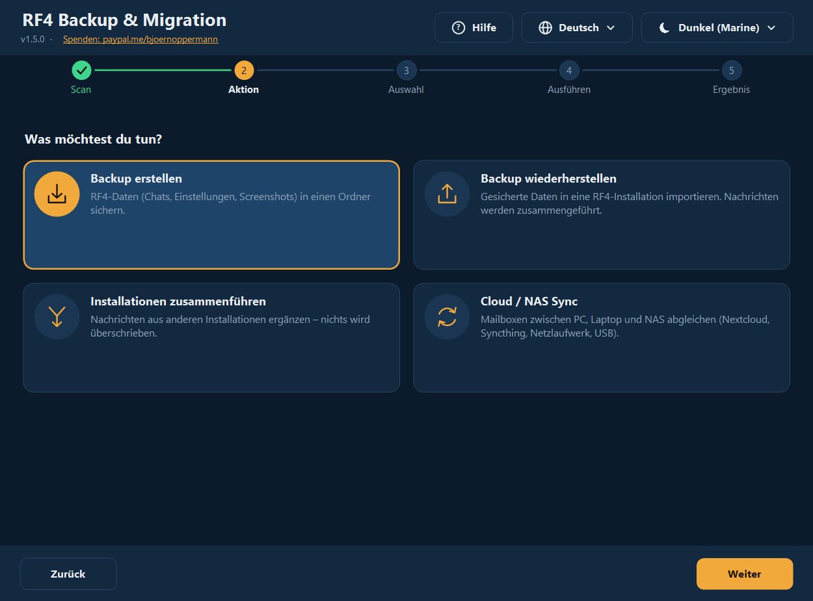
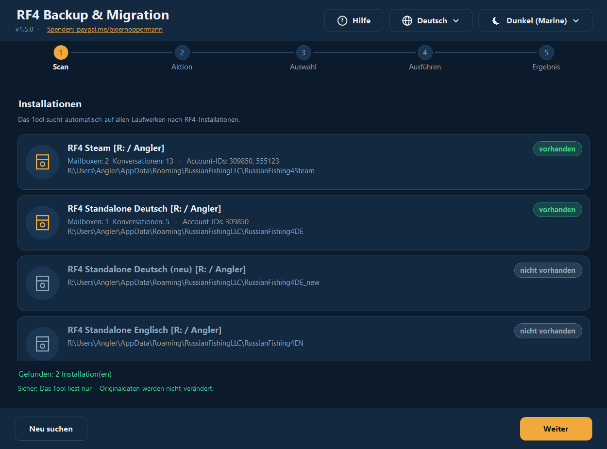
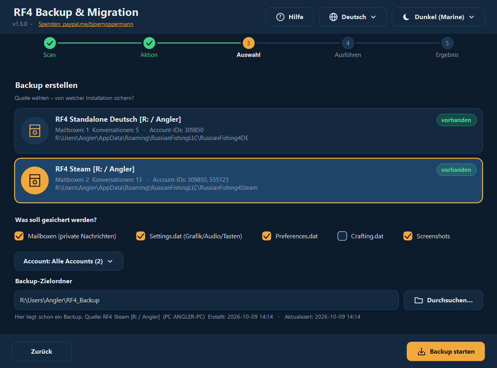
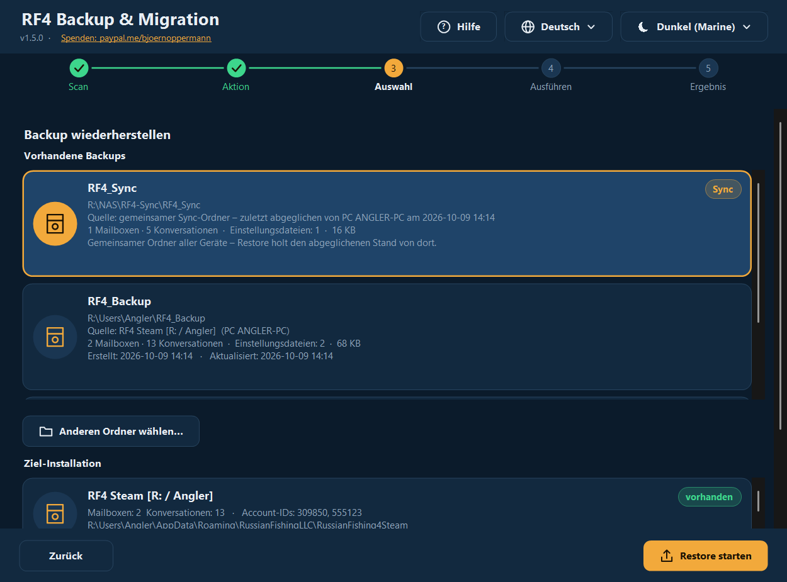
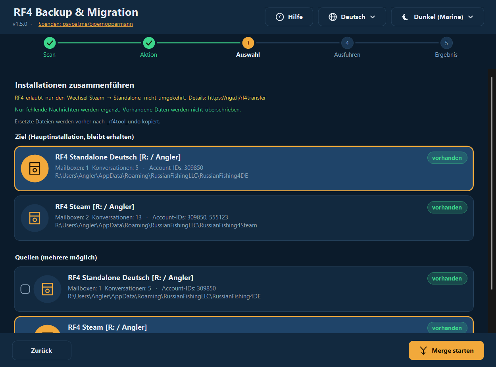
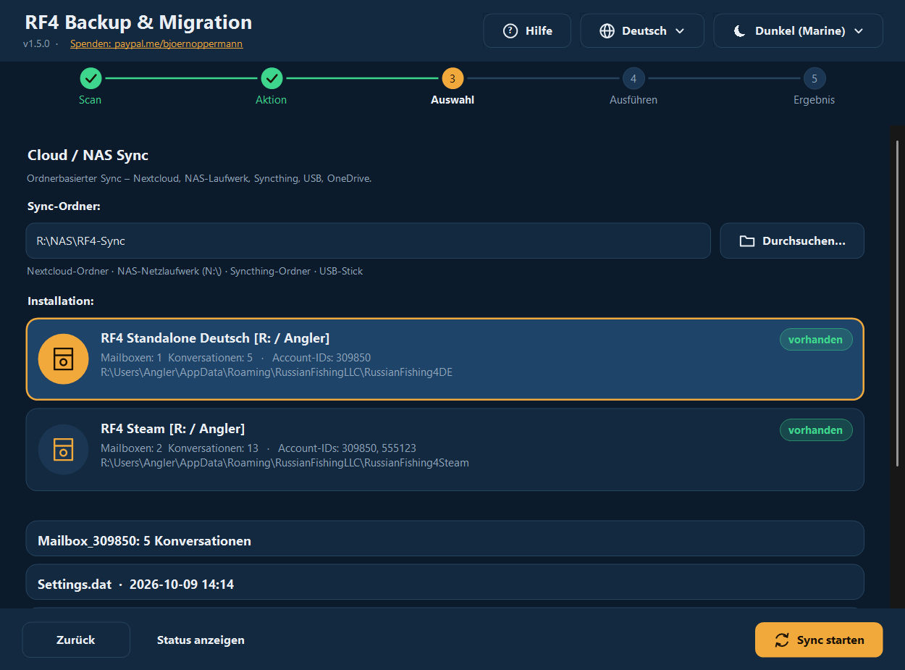
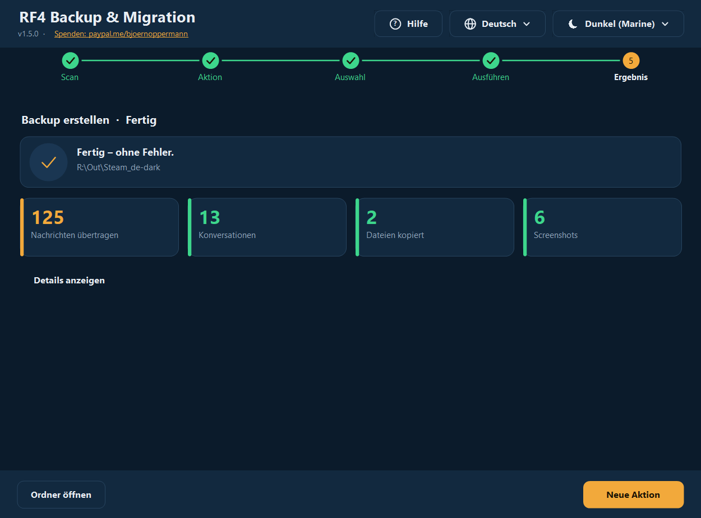
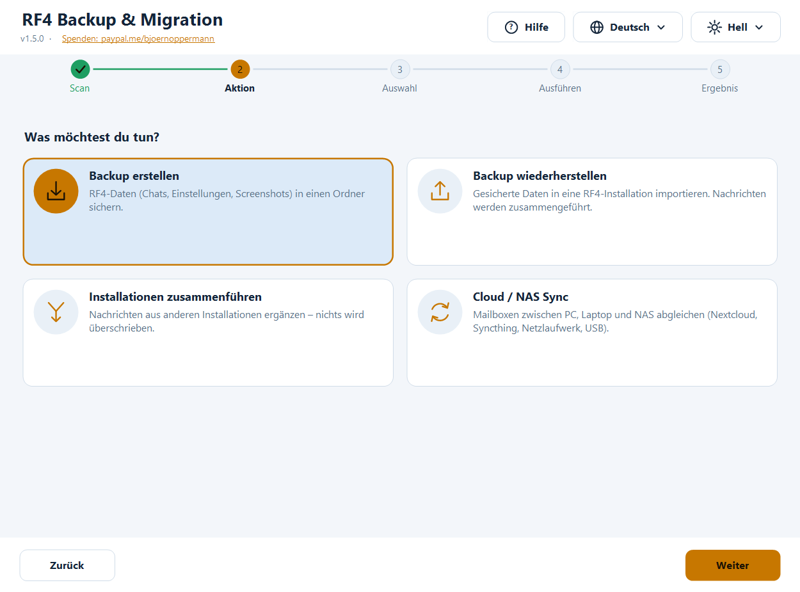
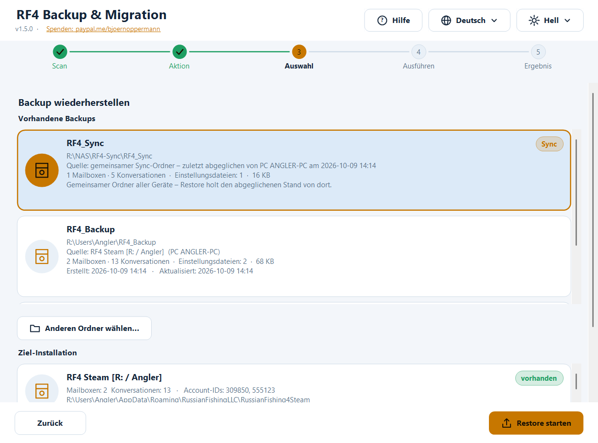
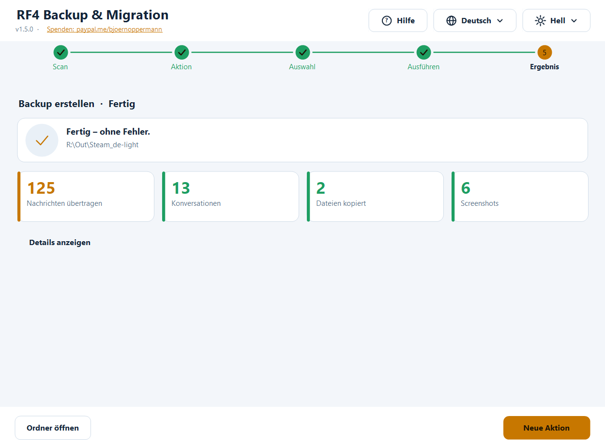

# RF4 — Backup & Migration Tool

**Deutsch** · [English](README.en.md) · [中文](README.zh.md) · [Русский](README.ru.md)

Kostenloses Werkzeug zum **Sichern, Wiederherstellen, Zusammenführen und Synchronisieren** deiner *Russian Fishing 4*-Spielerdaten:
Mailboxen (In-Game-Chats), Einstellungen und Screenshots. Für **Windows** (grafische Oberfläche + Terminal, PowerShell) und **Linux/macOS** (Bash).

- 🌍 **Vier Sprachen komplett umschaltbar:** Deutsch · English · 中文 · Русский — weitere Sprachen als einfache Textdatei ergänzbar
- 🎨 **Dunkel und Hell, automatisch** nach Windows-Einstellung (oder manuell) — weitere Designs als Textdatei ergänzbar
- 🖥️ **Scharf bei jeder Bildschirmskalierung** (100 % … 200 %, mehrere Monitore)
- 🛡️ **Es wird nichts gelöscht.** Ersetzte Dateien landen vorher in einem Undo-Ordner
- 🔍 Findet **Standalone, Steam, Wine, Proton**, andere Benutzer und andere Laufwerke automatisch
- 📍 Jedes Backup weiß, **von welcher Installation und von wann** es stammt; Wiederherstellen geht auch **aus dem Sync-Ordner / vom NAS**
- ❓ **Hilfe-Knopf** öffnet diese Anleitung (mit Screenshots) in der Sprache des Programms



📄 Anleitung & Blog: [nga.li/rf4b](https://nga.li/rf4b) · 📥 Download: [nga.li/rf4dl](https://nga.li/rf4dl) · 💻 Quellcode: [nga.li/rf4git](https://nga.li/rf4git)

---

## Inhalt

1. [Schnellstart](#schnellstart)
2. [Installation](#installation)
3. [Die grafische Oberfläche](#die-grafische-oberfläche)
4. [Das Terminal-Programm](#das-terminal-programm)
5. [Funktionen im Detail](#funktionen-im-detail)
6. [Sprachen und Designs (auch eigene)](#sprachen-und-designs)
7. [Wo liegen meine Daten?](#wo-liegen-meine-daten)
8. [Sicherheit & Verifikation](#sicherheit--verifikation)
9. [Häufige Fragen & Fehlerbehebung](#häufige-fragen--fehlerbehebung)
10. [Deinstallation](#deinstallation)
11. [Einstellungen, Umgebungsvariablen](#einstellungen-umgebungsvariablen)
12. [Entwicklung, Tests, Build](#entwicklung-tests-build)
13. [Änderungen](#änderungen)

---

## Schnellstart

**PC-Wechsel oder Neuinstallation in drei Schritten:**

1. **Alter PC:** Programm starten → **Backup erstellen** → Quelle wählen → *Backup starten*.
2. Backup-Ordner (Standard: `Benutzer\<Name>\RF4_Backup`) per USB-Stick, NAS oder Cloud auf den neuen PC bringen. RF4 dort **einmal starten und beenden**.
3. **Neuer PC:** Programm starten → **Backup wiederherstellen** → dein Backup in der Liste wählen → Ziel-Installation wählen → *Restore starten*.

Spielstand, Inventar und Angelausrüstung liegen auf den RF4-Servern und sind auf dem neuen PC automatisch da. Dieses Tool kümmert sich um das, was **lokal** liegt: Chats, Einstellungen, Screenshots.

---

## Installation

| Variante | Für wen | So geht’s |
|---|---|---|
| **Installer** (`rf4sa-backup-full-setup-v1.5.0.exe`) | Windows, empfohlen | Doppelklick, weiter, fertig. Legt Startmenü-Einträge (GUI, Terminal, **Anleitung mit Screenshots**, **Deinstallieren**) an; eine Seite mit **anklickbaren Links** (Spenden, Blog, Download, Quellcode) gehört dazu. Kein Admin nötig. |
| `rf4sa-backup-gui-setup-v1.5.0.exe` / `rf4sa-backup-cli-setup-v1.5.0.exe` | nur GUI bzw. nur Terminal | wie oben |
| **Ohne Installer** | Windows | Rechtsklick auf `rf4sa-backup-gui-v1.5.0.ps1` → **Mit PowerShell ausführen** |
| **Linux / macOS** | Bash | `bash rf4sa-backup-v1.5.0.sh` (benötigt bash ≥ 4 und `python3`) |

Alle Programmdateien tragen die **Version im Namen** (`rf4sa-backup-gui-v1.5.0.ps1`, `rf4sa-backup-v1.5.0.ps1`, `rf4sa-backup-v1.5.0.sh`), genau wie die Installer. Beim Update ersetzt der Installer die älteren Dateien.
Voraussetzungen Windows: Windows PowerShell 5.1 (ab Windows 10 vorinstalliert; Windows 7 mit WMF 5.1). Python wird unter Windows **nicht** benötigt.

> **Hinweis „Skriptausführung deaktiviert“:** Beim Rechtsklick-Start setzt Windows die Ausführungsrichtlinie automatisch für diesen einen Start. Falls trotzdem eine Meldung kommt:
> `powershell -ExecutionPolicy Bypass -File rf4sa-backup-gui-v1.5.0.ps1`

---

## Die grafische Oberfläche

Eine Schritt-für-Schritt-Führung mit fünf Stationen oben: **Scan → Aktion → Auswahl → Ausführen → Ergebnis**.
Oben rechts findest du jederzeit **Hilfe** (❓), **Sprache** (🌐) und **Design** (☀/☾). Die Oberfläche wechselt sofort, ohne Neustart. Der **Hilfe-Knopf** öffnet diese Anleitung offline im Browser — **in der Sprache, die gerade im Programm eingestellt ist**, mit passenden Screenshots.

### 1. Scan
Das Programm sucht alle RF4-Installationen: eigener Benutzer, andere Benutzer, alle Laufwerke. Gefundene sind markiert, mögliche (noch nicht vorhandene) Ziele grau. Die Liste ist scrollbar (Mausrad, auch direkt über einem Eintrag).



### 2. Aktion
Vier Karten: Backup erstellen · Backup wiederherstellen · Installationen zusammenführen · Cloud/NAS-Sync.


### 3. Auswahl

**Backup erstellen:** Quelle wählen, anhaken was gesichert werden soll (Mailboxen, Settings.dat, Preferences.dat, Crafting.dat, Screenshots), bei mehreren Accounts optional nur *einen* Account, Zielordner festlegen. Liegt dort schon ein Backup, erscheint ein Hinweis mit dessen Quelle und Datum.



**Backup wiederherstellen:** Oben siehst du alle **vorhandenen Backups** mit Inhalt, Größe, **Quelle** (aus welcher Installation, von welchem PC) und **Datum** (erstellt/aktualisiert) — das neueste zuerst. Aufgelistet werden der Standardordner, früher benutzte Ordner, deren Unterordner und der **Sync-Ordner** (Kennzeichen *Sync*). Mit *Anderen Ordner wählen…* nimmst du ein Backup von woanders (USB-Stick, **Netzlaufwerk/NAS**); dabei darf auch der **übergeordnete** Sync-Ordner gewählt werden (das Programm findet `RF4_Sync` darin selbst). Dann Ziel-Installation wählen; angehakt ist automatisch alles, was das Backup enthält.



**Zusammenführen:** Ziel (Hauptinstallation) wählen, eine oder mehrere Quellen anhaken. Nur fehlende Nachrichten werden ergänzt.



**Cloud/NAS-Sync:** Sync-Ordner angeben (Nextcloud, Syncthing, NAS-Laufwerk, USB …), Installation wählen, *Sync starten*. *Status anzeigen* zeigt, was schon im Sync-Ordner liegt.



### 4./5. Ausführen und Ergebnis
Während der Arbeit zeigt ein Fortschrittsbalken die aktuelle Zeile. Danach siehst du **Kennzahlen** (übertragene Nachrichten, Konversationen, kopierte Dateien, Screenshots, übersprungen, Fehler). *Details anzeigen* klappt das ausführliche Protokoll auf; *Ordner öffnen* öffnet das Ziel im Explorer.



### Hell und Dunkel

**Design:** *Automatisch (wie Windows)* ist Standard — wechselst du in Windows zwischen hellem und dunklem Modus, zieht das Programm **sofort** mit (auch während es läuft). Du kannst ein festes Design wählen.





**Sprache:** beim ersten Start nach der Windows-Sprache, sonst Englisch; die Wahl wird gespeichert.
**Tastatur:** `Tab` wechselt zwischen Karten/Schaltflächen, `Leertaste`/`Enter` wählt aus.
**Hochauflösende Monitore:** Das Programm ist DPI-bewusst (Per-Monitor v2) — Text und Symbole werden nativ gezeichnet, nicht hochskaliert. Beim Verschieben auf einen anderen Monitor passt sich alles an.

---

## Das Terminal-Programm

```powershell
powershell -ExecutionPolicy Bypass -File rf4sa-backup-v1.5.0.ps1            # Sprache automatisch
powershell -ExecutionPolicy Bypass -File rf4sa-backup-v1.5.0.ps1 -Lang zh   # fest: de | en | zh | ru | eigene
```

```
  ╔════════════════════════════════════════════════════════════╗
  ║ RF4 Backup & Migration   v1.5.0                            ║
  ║ RF4: nga.li/rf4de  ·  Blog: nga.li/rf4b                    ║
  ║ Spenden: paypal.me/bjoernoppermann                         ║
  ╚════════════════════════════════════════════════════════════╝

   [1] Scan – Alle Installationen anzeigen
   [2] Backup – Daten sichern
   [3] Restore – Aus Backup importieren
   [4] Merge – Installationen zusammenführen
   [5] Sync – Mit Cloud/NAS abgleichen
   [H] Hilfe / Anleitung
   [L] Sprache wechseln  (Deutsch)
   [0] Beenden
```

- Menüs: Nummer eingeben. Mehrfachauswahl: Nummern ein-/ausschalten (`1 3 4` oder `1,3`), `a` = alle, `n` = keine, `Enter` = weiter, `0` = zurück.
- **`[H]`** öffnet die Anleitung (HTML mit Screenshots) in der aktuellen Programmsprache.
- **Restore** bietet die vorhandenen Backups als Liste an (mit Pfad, Quelle, Inhalt, Datum; der Sync-Ordner ist mit `[Sync]` markiert) oder die manuelle Pfadeingabe — auch UNC-Pfade wie `\\NAS\rf4\RF4_Sync`.
- Nach jeder Aktion gibt es eine **Zusammenfassung** mit Kennzahlen.
- Rahmen und Symbole sind Unicode, auch mit 中文 sauber ausgerichtet (Doppelbreite wird berücksichtigt). Mit `RF4_ASCII=1` gibt es eine reine ASCII-Darstellung (für alte Konsolen/Logs).
- Für 中文 am besten **Windows Terminal** verwenden (die klassische Konsole kann je nach Schrift Kästchen zeigen).

**Linux / macOS:**

```bash
bash rf4sa-backup-v1.5.0.sh            # Sprache automatisch (LANG), oder:
bash rf4sa-backup-v1.5.0.sh -l ru
```

Gefunden werden: Windows-Partitionen (`/mnt/*`, `/run/media/*/*`), Wine-Prefixes (`~/.wine`, `~/.local/share/wineprefixes/*`, Lutris), Steam-Proton (`…/steamapps/compatdata/*`, auch Flatpak). Gleiche Menüs wie unter Windows (`[H]` öffnet die Anleitung mit `xdg-open`/`open`).

---

## Funktionen im Detail

### Was wird gesichert?
| Element | Inhalt |
|---|---|
| **Mailboxen** | In-Game-Chats (`Mailbox_<AccountID>\*.dat`, JSON). Lokal gespeichert, nicht auf den RF4-Servern. |
| **Settings.dat** | Grafik, Audio, Tastenbelegung |
| **Preferences.dat** | weitere Spieleinstellungen |
| **Crafting.dat** | Crafting-Daten |
| **Screenshots** | `Dokumente\Russian Fishing 4\Screenshots` (auch in Unterordnern; vorhandene Namen werden nie überschrieben) |

### Backup
Kopiert die gewählten Elemente in den Zielordner. Mailboxen werden dabei **zusammengeführt**, nicht blind überschrieben — ein Backup in einen bereits vorhandenen Ordner ist also ein *inkrementelles* Backup. Bei abweichenden Einstellungsdateien fragt das Programm vorher.
Im Backup-Ordner legt das Programm die Datei `rf4-backup.info` an: **Quelle** (Installation, Variante, PC-Name, Benutzer), **erstellt**, **aktualisiert** und eine kurze Historie der letzten Sicherungen. Daran erkennst du später in der Restore-Liste (GUI, Terminal, Bash), woher ein Backup stammt und wie aktuell es ist. Die Datei ist reiner Text und plattformübergreifend lesbar.

### Restore
Importiert ein Backup in eine Installation (auch in eine noch leere, neue). Nachrichten werden zusammengeführt, Einstellungsdateien nur nach Rückfrage ersetzt. Das Programm warnt, wenn **RF4 noch läuft** (nur der Spielprozess `rf4_x64`/`rf4_x32` zählt — ein offener Launcher oder Installer löst keine Warnung aus). Bitte das Spiel vorher beenden, sonst überschreibt es deine Änderungen beim Beenden.

**Wiederherstellen aus Sync-Ordner / NAS / Netzlaufwerk:**
- Der eingestellte **Sync-Ordner** erscheint automatisch in der Backup-Liste (Kennzeichen *Sync*, Quelle: „zuletzt abgeglichen von PC … am …“) — einfach anklicken.
- Oder mit *Anderen Ordner wählen…* beliebig dorthin navigieren: Sync-Ordner, **dessen übergeordneten Ordner** oder ein Backup-Ordner. Das Programm erkennt `RF4_Sync` im gewählten Ordner selbst.
- Das Netzlaufwerk muss verbunden sein. Tipp: Laufwerksbuchstaben gelten nur in der Windows-Sitzung, in der sie verbunden wurden — bei „Als Administrator ausführen“ oder in anderen Sitzungen besser den **UNC-Pfad** (`\\NAS\Freigabe\…`) verwenden.
- Findet das Programm dort nichts, sagt es das klar („kein Backup gefunden, auch nicht im Unterordner RF4_Sync“) statt still zu scheitern.

### Merge (Zusammenführen)
Ergänzt in der Ziel-Installation alle Nachrichten, die dort fehlen:

1. Jede Nachricht hat eine eindeutige ID (`meta.id`). Es wird über die ID **dedupliziert** — nichts wird doppelt.
2. Neue Nachrichten werden nach Zeit (`meta.created`) einsortiert.
3. Eine Datei wird **nur geschrieben, wenn wirklich neue Nachrichten dazukommen**. Geschrieben wird über eine Temp-Datei, die erst nach erfolgreicher Gegenprobe (JSON wieder lesbar) das Original ersetzt.
4. Das Original wird vorher in den Undo-Ordner kopiert.

Typische Fälle: Steam → Standalone, Steam → Steam (neuer PC), Standalone → Standalone, mehrere alte Installationen → eine neue.
> RF4 erlaubt offiziell nur den Wechsel **Steam → Standalone**, nicht umgekehrt. Details: [nga.li/rf4transfer](https://nga.li/rf4transfer)

### Cloud / NAS-Sync
Bidirektional über einen gemeinsamen Ordner (Unterordner `RF4_Sync`):

1. **Lokal → Sync:** neue Nachrichten werden in den Sync-Ordner gemergt.
2. **Sync → Lokal:** neue Nachrichten aus dem Sync-Ordner (von anderen Geräten) werden lokal gemergt.
3. **Einstellungsdateien:** die **neuere** Datei (Zeitstempel) gewinnt; bei Gleichstand/Identität passiert nichts.

Auf jedem Gerät denselben Ordner verwenden. Funktioniert mit Nextcloud, Syncthing, OneDrive, Netzlaufwerk (auch OpenMediaVault/OMV-Freigaben), USB-Stick. In `RF4_Sync\.sync_log` steht, welches Gerät wann zuletzt abgeglichen hat.

### Der Undo-Ordner
Bei Restore, Merge und Sync wird **jede Datei, die ersetzt wird, vorher kopiert** nach:

```
<Installation>\_rf4tool_undo\<Datum_Uhrzeit>\<Ordner>\<Datei>
```

Zum Rückgängigmachen die Datei von dort zurückkopieren. Der Ordner stört RF4 nicht; du kannst ihn jederzeit selbst löschen. Das Programm löscht ihn nie.

---

## Sprachen und Designs

Alles ist **modular**: Sprachen und Designs sind einfache Textdateien. Eingebaut sind die vier Sprachen und zwei Designs; weitere werden beim Start automatisch gefunden — ohne Neukompilieren.

### Eigene Sprache hinzufügen
1. Vorlage kopieren: [`examples/template.lang`](examples/template.lang) nach  
   `%APPDATA%\rf4-backup\lang\pt.lang` (oder in einen Ordner `lang\` **neben** das Skript; Linux: `~/.config/rf4-backup/lang/pt.lang`).
2. Oben `@code=pt` und `@name=Português` setzen, die Texte rechts vom `=` übersetzen. **Fehlende Zeilen** fallen automatisch auf Englisch zurück — du kannst also auch nur Teile übersetzen.
3. Programm neu starten: die Sprache steht im Sprachmenü (und wird bei passender Windows-Sprache sogar automatisch gewählt).

Platzhalter `{0}`, `{1}` müssen im Text bleiben (sie werden durch Namen/Zahlen ersetzt). Dateikodierung: UTF-8. Die **Anleitung** (Hilfe-Knopf) gibt es in den vier eingebauten Sprachen; für eine eigene Sprache öffnet sich die englische Fassung.

```ini
@code=pt
@name=Português
app_title=RF4 Cópia e Migração
menu_backup=Cópia – guardar dados
```

### Eigenes Design hinzufügen
Vorlage [`examples/template.theme`](examples/template.theme) nach `%APPDATA%\rf4-backup\themes\<name>.theme` kopieren und Farben (`#RRGGBB`) anpassen. `@base=dark|light` legt fest, welchen Windows-Modus es bei „Automatisch“ vertritt. Nicht gesetzte Farben kommen aus dem Dunkel-Design. Es erscheint im Design-Menü.

### Eingebaut
| Design | Beschreibung |
|---|---|
| **Dunkel (Marine)** | tiefes Marineblau, warmes Bernstein als Akzent |
| **Hell** | helles Blaugrau, dunkleres Bernstein (Kontrast geprüft) |

Die Kontraste (Text/Hintergrund ≥ 7:1, Schaltflächen ≥ 4,5:1) werden von den Tests geprüft.

---

## Wo liegen meine Daten?

```
%APPDATA%\RussianFishingLLC\<Variante>\Mailbox_<AccountID>\*.dat      Chats (JSON, UTF-8 mit BOM)
%APPDATA%\RussianFishingLLC\<Variante>\Settings.dat | Preferences.dat | Crafting.dat
Dokumente\Russian Fishing 4\Screenshots
```

| Ordnername | Bezeichnung |
|---|---|
| `RussianFishing4DE` | RF4 Standalone Deutsch |
| `RussianFishing4DE_new` | RF4 Standalone Deutsch (neu) |
| `RussianFishing4EN` | RF4 Standalone Englisch |
| `RussianFishing4Steam` | RF4 Steam |
| *(jeder weitere Ordner dort)* | wird automatisch erkannt |

Unter Linux liegt derselbe Pfad im jeweiligen Wine-/Proton-Prefix (`…/drive_c/users/<name>/AppData/Roaming/RussianFishingLLC/…`).

**Das Tool selbst speichert** (nur Einstellungen, keine Spieldaten): `%APPDATA%\rf4-backup\settings.json` (Sprache, Design, Sync-Ordner, zuletzt benutzte Backup-Ordner) bzw. `~/.config/rf4-backup/settings.conf`; bei unerwarteten Fehlern zusätzlich `error.log` im selben Ordner.

---

## Sicherheit & Verifikation

- **Es wird nichts gelöscht** — weder Spieldaten noch Backups noch der Undo-Ordner.
- Scan und Backup **lesen nur** aus der Installation.
- Schreibende Aktionen (Restore/Merge/Sync) kopieren ersetzte Dateien vorher in den Undo-Ordner; Nachrichten-Dateien werden atomar mit Gegenprobe geschrieben und nur bei echten Änderungen.
- Vor Restore/Merge/Sync wird geprüft, ob RF4 läuft (Warnung).
- Unerwartete Fehler lassen das Programm nicht abstürzen: es zeigt eine Meldung und schreibt Details nach `%APPDATA%\rf4-backup\error.log`.
- Kein Netzwerkzugriff (außer dem, was du selbst als Sync-/Backup-Ordner angibst), keine Telemetrie. Der Quellcode ist vollständig lesbar (die ausgelieferten `.ps1`/`.sh`-Dateien sind der Code).

**Prüfsummen:** siehe [CHECKSUMS.txt](CHECKSUMS.txt).
```powershell
Get-FileHash .\rf4sa-backup-gui-v1.5.0.ps1 -Algorithm SHA256        # Windows
```
```bash
sha256sum rf4sa-backup-v1.5.0.sh                                     # Linux
```
Vergleiche den Hash vor dem ersten Start mit der Datei `CHECKSUMS.txt` (oder dem Wert auf [nga.li/rf4dl](https://nga.li/rf4dl)).

---

## Häufige Fragen & Fehlerbehebung

**„Keine Installation gefunden“**
RF4 muss mindestens **einmal gestartet** worden sein (dann legt es den Datenordner an). Prüfe, ob `%APPDATA%\RussianFishingLLC` existiert. Installationen auf anderen Laufwerken werden gefunden, wenn dort ein `Users`-Ordner liegt; sonst beim Restore *manuell* den Zielpfad wählen.

**Mein Backup erscheint nicht in der Liste**
Die Liste zeigt den Standardordner `RF4_Backup`, früher benutzte Ordner, den Sync-Ordner und je eine Ebene darunter. Ein Ordner gilt als Backup, wenn er `Mailbox_*`-Ordner, eine der `.dat`-Dateien oder einen `Screenshots`-Ordner enthält. Anderen Ort über *Anderen Ordner wählen…*.

**Restore vom NAS / Sync-Ordner klappt nicht**
Prüfe, ob das Laufwerk verbunden und erreichbar ist (Explorer). Bei Start „als Administrator“ sieht das Programm Netzlaufwerke der normalen Sitzung nicht — nimm den UNC-Pfad. Wähle entweder den Sync-Ordner selbst, den übergeordneten Ordner oder den Eintrag mit dem Kennzeichen *Sync* aus der Liste. Bleibt die Meldung „kein Backup gefunden“, enthält der Ordner (noch) keine `Mailbox_*`-Daten: erst einmal von einem Gerät aus *Sync* ausführen.

**Nach dem Restore sehe ich keine Chats**
RF4 muss **beendet** gewesen sein, als du importiert hast. Importiere erneut (idempotent) oder kopiere aus dem Undo-Ordner zurück. Prüfe außerdem die Account-ID: Chats liegen unter der ID deines Kontos (`Mailbox_<ID>`).

**Die Warnung „RF4 läuft“ erscheint, obwohl ich nur den Launcher offen habe**
Das sollte nicht mehr passieren: nur `rf4_x64`/`rf4_x32` zählen. Erscheint sie trotzdem, läuft das Spiel noch im Hintergrund (Task-Manager).

**Die Liste zeigt nicht alle Einträge**
Sie ist scrollbar: Mausrad (auch direkt über einem Eintrag) oder der Scrollbalken rechts. Das Fenster lässt sich vergrößern.

**„Das Skript kann nicht ausgeführt werden“**
`powershell -ExecutionPolicy Bypass -File <Datei>`; bei heruntergeladenen Dateien ggf. Rechtsklick → Eigenschaften → *Zulassen*.

**中文 / Русский zeigt Kästchen im Terminal**
Windows Terminal verwenden oder eine Schriftart mit CJK/Kyrillisch wählen. Die GUI ist davon nicht betroffen.

**Die GUI ist zu groß für meinen Bildschirm**
Die Startgröße richtet sich nach dem Bildschirm; das Fenster ist in der Größe veränderbar, der Inhalt scrollt bei Platzmangel.

**Steam Cloud überschreibt Dateien?**
Möglich bei Steam-Installationen, wenn Steam Cloud für RF4 aktiv ist. Nach einem Restore Steam ggf. offline starten oder die Cloud-Synchronisation für das Spiel kurz deaktivieren.

**Linux: `python3` fehlt**
`sudo apt install python3` (Debian/Ubuntu). Python wird nur zum Zusammenführen der JSON-Dateien benötigt.

---

## Deinstallation

- **Installer-Variante:** Startmenü → *RF4 Backup Tool* → **RF4 Backup Tool deinstallieren** (oder Windows-Einstellungen → Apps). Der Deinstaller entfernt nur die Programmdateien und fragt, ob auch die gespeicherten **Einstellungen** (Sprache, Design, Sync-Ordner, eigene Sprach-/Designdateien) gelöscht werden sollen. **Deine RF4-Spieldaten und deine Backups werden nie angefasst.**
- **Ohne Installer:** einfach die Dateien löschen. Optional den Ordner `%APPDATA%\rf4-backup` (Linux: `~/.config/rf4-backup`).

---

## Einstellungen, Umgebungsvariablen

| Variable | Wirkung |
|---|---|
| `RF4_LANG=xx` | Sprache festlegen (de, en, zh, ru oder eigene) |
| `RF4_ASCII=1` | Terminal: reine ASCII-Darstellung |
| `RF4_BACKUP_DIRS=a;b` (Linux: `a:b`) | zusätzliche Ordner, in denen nach Backups gesucht wird |
| `RF4_SCAN_USERS=a;b` (Linux: `a:b`) | zusätzliche „Users“-Ordner, die nach Installationen durchsucht werden |
| `RF4_NO_DRIVE_SCAN=1` | nicht alle Laufwerke durchsuchen |
| `RF4_THEME_BASE=dark\|light` | Windows-Modus für „Automatisch“ erzwingen (Tests) |
| `RF4_GUI_SCALE=1.5` | Skalierung der GUI erzwingen (Tests/Screenshots) |
| `RF4_FAKE_RUNNING=rf4_x64` | simuliert ein laufendes Spiel (Tests) |

---

## Entwicklung, Tests, Build

Der Quellcode liegt in `src/`:

| Datei | Inhalt |
|---|---|
| `core.ps1` | gemeinsame Logik (Scan, Merge, Backup/Restore, Sync, Backups finden, Backup-Info, Statistik, Konfiguration, Laden von Sprachen/Designs, Hilfe öffnen) |
| `lang/*.lang` | alle Texte (eine Datei je Sprache) |
| `themes/*.theme` | Farben (eine Datei je Design) |
| `ui.cs` | selbst gezeichnete GUI-Bausteine (Buttons, Karten, Fortschritt, Stepper …), DPI-bewusst |
| `gui.ps1`, `cli.ps1` | Oberflächen |
| `cli.sh` | Linux/macOS-Skript |

`build.ps1` erzeugt daraus die ausgelieferten Einzeldateien **mit Version im Namen** (Sprachen, Designs und C#-Code werden eingebettet; die Bash-Sprachtabelle wird aus den `.lang`-Dateien erzeugt — **eine Quelle für alle Plattformen**) sowie die Anleitung als HTML (`docs/guide.<sprache>.html`, aus den vier READMEs, mit Screenshots).

```powershell
powershell -ExecutionPolicy Bypass -File build.ps1
powershell -ExecutionPolicy Bypass -File tests\Test-Core.ps1 [-RealDataDir <Mailbox-Ordner>]   # Logik, Sprachen/Themes, Kontraste, Merge, Sync, Backup-Info
powershell -ExecutionPolicy Bypass -File tests\Test-Cli.ps1                                    # Terminal: alle Sprachen, Rahmenbreite, Abläufe
powershell -STA -ExecutionPolicy Bypass -File tests\Test-Gui.ps1                               # GUI: Panels × Design × Sprache × Skalierung, Überlauf, Dialoge, Mausrad
powershell -STA -ExecutionPolicy Bypass -File tests\Test-RealFlow.ps1                          # alle Funktionen mit echten Dialogen auf Fake-Installationen im echten Profil
bash tests/test-sh.sh                                                                          # Linux-Skript
powershell -STA -ExecutionPolicy Bypass -File tools\make-screenshots.ps1                       # Screenshots für die Anleitung (je Sprache, Demo-Daten)
```

**Gefahrlos mit realistischen Daten testen:** `tools\fake-installs.ps1 -Create` legt aus einer echten Installation die Fake-Installationen `RussianFishing4TEST_A/_B/_C` an (überlappende Konversationen, zweiter Account, abweichende Einstellungen); `-Remove` löscht nur solche mit Marker-Datei. Die Originale werden nie verändert.

Neuer Text: Schlüssel in **alle** `src/lang/*.lang` eintragen (Tests prüfen, dass jeder Schlüssel in jeder eingebauten Sprache vorhanden ist und die Platzhalter übereinstimmen; `tools\add-lang-keys.ps1` hilft), dann `build.ps1`.
Änderungen an der Anleitung: in **allen vier** READMEs gleich nachziehen (gleiche Abschnitte/Bilder), dann `build.ps1` und `tools\make-screenshots.ps1`.
Installer: `installer/*.iss` mit [Inno Setup 6](https://jrsoftware.org/isinfo.php) (`ISCC.exe installer\rf4sa-backup-full.iss`).

---

## Änderungen

**1.5.0**
- **Neue Oberfläche:** komplett neu gezeichnet, scharf bei jeder DPI, Dunkel/Hell **automatisch** nach Windows, Hilfe-/Sprach-/Design-Menü im Kopf, Karten statt Listen, Stepper, Fortschrittsbalken, Ergebnis mit Kennzahlen. Das Log-Fenster am unteren Rand entfällt (Details einklappbar).
- **Vorhandene Backups** werden in Restore (GUI, Terminal, Bash) aufgelistet, mit **Quelle und Datum** (`rf4-backup.info`); benutzte Ordner werden gemerkt. **Restore aus Sync-Ordner/NAS** funktioniert aus der Liste oder über den (übergeordneten) Ordner.
- **Hilfe in der Programmsprache:** Hilfe-Knopf (GUI), `[H]` (Terminal/Bash) und Startmenü öffnen die Anleitung als HTML mit **zur Sprache passenden Screenshots**; alle vier Sprachfassungen haben denselben Inhalt.
- **Modular:** Sprachen als `lang/*.lang`, Designs als `themes/*.theme` — eigene Dateien werden automatisch erkannt.
- **Dateien mit Version im Namen** (`rf4sa-backup-gui-v1.5.0.ps1` …), der Installer ersetzt ältere Dateien.
- **Installer:** Startmenü-Einträge inkl. Anleitung und Deinstallation, anklickbare Links, Abfrage zu den gespeicherten Einstellungen beim Deinstallieren.
- **Fixes:** Meldungsdialog (z. B. „RF4 läuft“) stürzte mit .NET-Fehler ab und brach Restore/Merge/Sync ab; ein offener Launcher löste die Warnung fälschlich aus; das Mausrad scrollte Listen nicht; der übergeordnete Sync-Ordner wurde beim Restore nicht erkannt.
- **Terminal und Bash:** Rahmen/Symbole (CJK-breitenrichtig), farbige Zusammenfassung, ASCII-Fallback.
- Mehr als 380 automatische Prüfungen (Logik, Terminal, GUI, Echtdaten-Durchlauf mit echten Dialogen, Linux) inkl. Kontrastprüfung der Designs.

**1.4.0** gemeinsamer Kern, komplette Übersetzung (DE/EN/ZH/RU), Fixes (eigene Installation wurde nie gefunden, Abstürze bei einzelnen Dateien, Screenshots beim Restore), Undo-Ordner, Warnung bei laufendem RF4.
**1.3.0** i18n (nur Menüs), InnoSetup-Installer · **1.2.0** Cloud/NAS-Sync · **1.1.x** Account-IDs, Multi-Quellen-Merge · **1.0.0** Erstveröffentlichung

---

## Links & Lizenz

| | |
|---|---|
| RF4 Offiziell (DE / EN) | [nga.li/rf4de](https://nga.li/rf4de) · [nga.li/rf4en](https://nga.li/rf4en) |
| RF4 auf Steam | [nga.li/rf4steam](https://nga.li/rf4steam) |
| Steam → Standalone Transfer | [nga.li/rf4transfer](https://nga.li/rf4transfer) |
| Forum | [nga.li/rf4forum](https://nga.li/rf4forum) |
| Artikel & Anleitung | [nga.li/rf4b](https://nga.li/rf4b) |
| Quellcode (Codeberg) | [codeberg.org/Natural78/rf4-backup-tool](https://codeberg.org/Natural78/rf4-backup-tool) |

MIT License — frei verwendbar, veränderbar und weitergebbar. Wenn dir das Tool gefällt: [paypal.me/bjoernoppermann](https://paypal.me/bjoernoppermann) ☕
