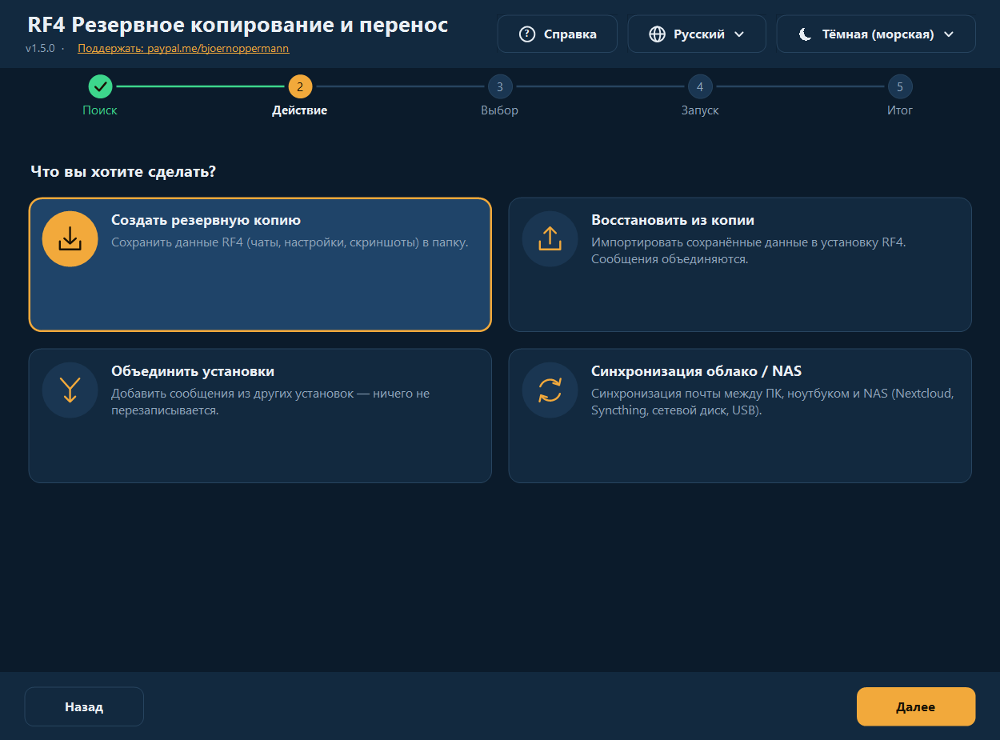
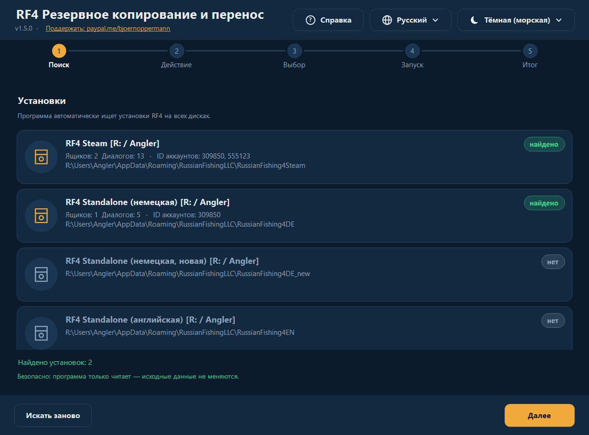
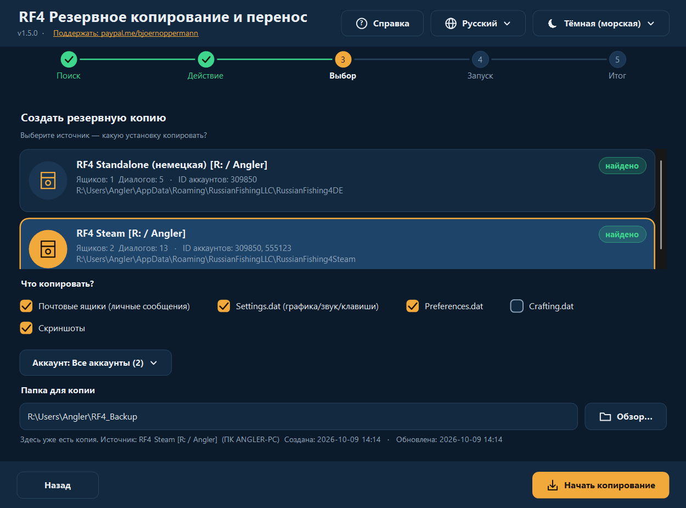
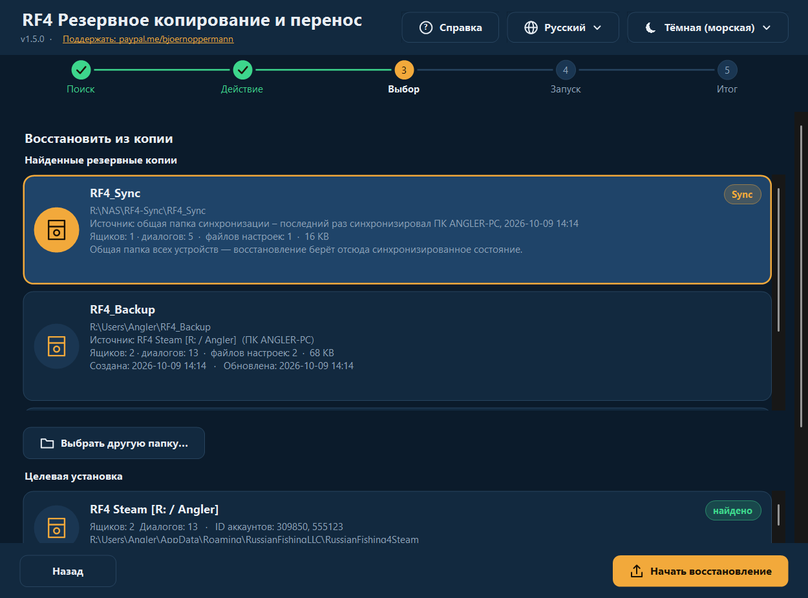
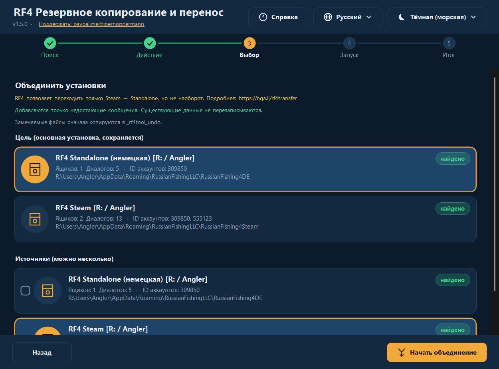
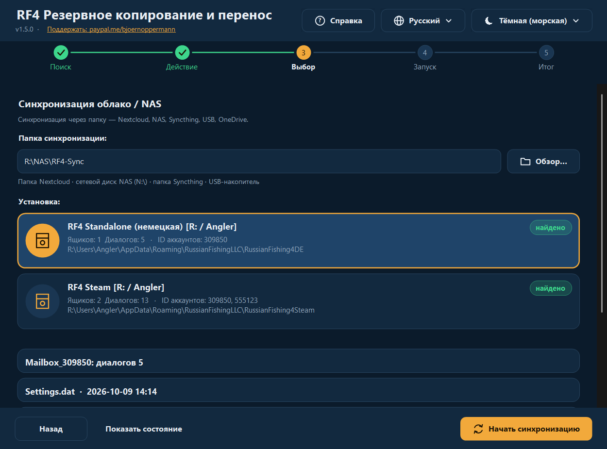
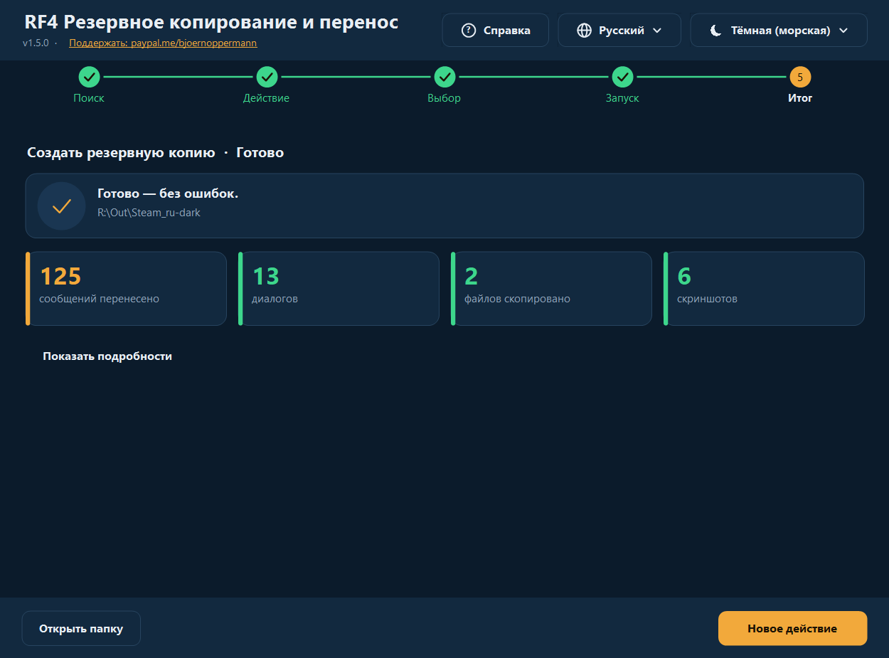
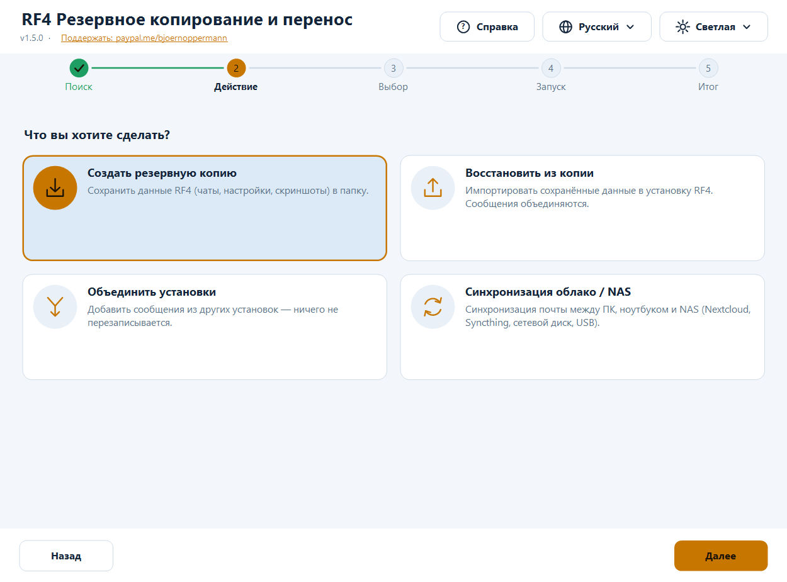
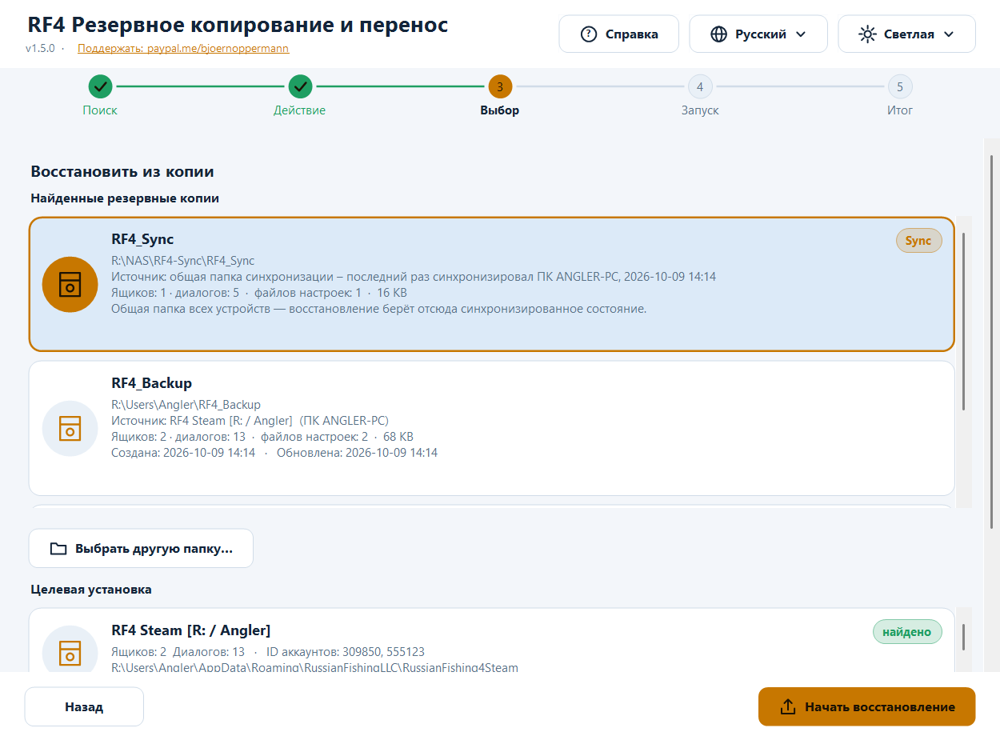
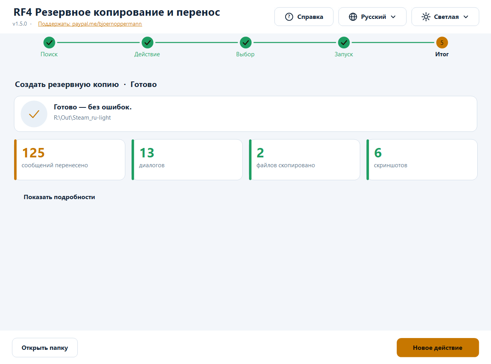

# RF4 — Резервное копирование и перенос

[Deutsch](README.md) · [English](README.en.md) · [中文](README.zh.md) · **Русский**

Бесплатная программа для **резервного копирования, восстановления, объединения и синхронизации** данных игрока *Russian Fishing 4*:
игровая почта (чаты), настройки и скриншоты. Для **Windows** (графический интерфейс + терминал, PowerShell) и **Linux/macOS** (bash).

- 🌍 **Четыре языка, полное переключение в любой момент:** Deutsch · English · 中文 · Русский — новые языки добавляются обычным текстовым файлом
- 🎨 **Тёмная и светлая тема автоматически** (по настройке Windows или вручную) — новые темы тоже текстовым файлом
- 🖥️ **Чёткое изображение при любом масштабе** (100 % … 200 %, несколько мониторов)
- 🛡️ **Ничего не удаляется.** Заменяемые файлы сначала копируются в папку отмены
- 🔍 Автоматически находит **Standalone, Steam, Wine, Proton**, других пользователей и другие диски
- 📍 Каждая копия знает, **из какой установки и когда** она создана; восстановление работает и **из папки синхронизации / с NAS**
- ❓ **Кнопка справки** открывает это руководство (со скриншотами) на языке программы



📄 Руководство и блог: [nga.li/rf4b](https://nga.li/rf4b) · 📥 Загрузка: [nga.li/rf4dl](https://nga.li/rf4dl) · 💻 Исходный код: [nga.li/rf4git](https://nga.li/rf4git)

---

## Содержание

1. [Быстрый старт](#быстрый-старт)
2. [Установка](#установка)
3. [Графический интерфейс](#графический-интерфейс)
4. [Программа для терминала](#программа-для-терминала)
5. [Возможности подробно](#возможности-подробно)
6. [Языки и темы (свои тоже)](#языки-и-темы)
7. [Где лежат данные](#где-лежат-данные)
8. [Безопасность и проверка](#безопасность-и-проверка)
9. [Частые вопросы и устранение неполадок](#частые-вопросы-и-устранение-неполадок)
10. [Удаление](#удаление)
11. [Настройки, переменные окружения](#настройки-переменные-окружения)
12. [Разработка, тесты, сборка](#разработка-тесты-сборка)
13. [История изменений](#история-изменений)

---

## Быстрый старт

**Переезд на новый ПК или переустановка в три шага:**

1. **Старый ПК:** запустите программу → **Создать резервную копию** → выберите источник → *Начать копирование*.
2. Перенесите папку копии (по умолчанию `Users\<имя>\RF4_Backup`) на новый ПК: флешка, NAS или облако. Запустите там RF4 **один раз и закройте**.
3. **Новый ПК:** запустите программу → **Восстановить из копии** → выберите копию в списке → выберите целевую установку → *Начать восстановление*.

Прогресс, инвентарь и снасти хранятся на серверах RF4 и на новом ПК появятся сами. Программа занимается тем, что лежит **локально**: чаты, настройки, скриншоты.

---

## Установка

| Вариант | Для кого | Как |
|---|---|---|
| **Установщик** (`rf4sa-backup-full-setup-v1.5.0.exe`) | Windows, рекомендуется | Двойной щелчок, далее, готово. Создаёт пункты меню «Пуск» (GUI, терминал, **руководство со скриншотами**, **удаление**) и страницу с **кликабельными ссылками** (пожертвование, блог, загрузка, исходный код). Права администратора не нужны. |
| `rf4sa-backup-gui-setup-v1.5.0.exe` / `rf4sa-backup-cli-setup-v1.5.0.exe` | только GUI / только терминал | как выше |
| **Без установки** | Windows | ПКМ на `rf4sa-backup-gui-v1.5.0.ps1` → **Выполнить с помощью PowerShell** |
| **Linux / macOS** | bash | `bash rf4sa-backup-v1.5.0.sh` (нужны bash ≥ 4 и `python3`) |

Во всех файлах программы **версия указана в имени** (`rf4sa-backup-gui-v1.5.0.ps1`, `rf4sa-backup-v1.5.0.ps1`, `rf4sa-backup-v1.5.0.sh`) — так же, как у установщиков. При обновлении установщик заменяет старые файлы.
Требования для Windows: Windows PowerShell 5.1 (есть в Windows 10/11; для Windows 7 — WMF 5.1). Python в Windows **не нужен**.

> **Примечание «выполнение скриптов отключено»:** при запуске правой кнопкой Windows автоматически задаёт политику выполнения для этого одного запуска. Если сообщение всё же появляется:
> `powershell -ExecutionPolicy Bypass -File rf4sa-backup-gui-v1.5.0.ps1`

---

## Графический интерфейс

Пошаговое сопровождение с пятью этапами вверху: **Поиск → Действие → Выбор → Запуск → Итог**.
Справа вверху всегда доступны **Справка** (❓), **Язык** (🌐) и **Тема** (☀/☾). Интерфейс переключается мгновенно, без перезапуска. **Кнопка справки** открывает это руководство офлайн в браузере — **на языке, который сейчас выбран в программе**, с подходящими скриншотами.

### 1. Поиск
Программа ищет все установки RF4: ваш пользователь, другие пользователи, все диски. Найденные отмечены, возможные (ещё не существующие) цели показаны серым. Список прокручивается (колесо мыши, в том числе прямо над записью).



### 2. Действие
Четыре карточки: создать копию · восстановить из копии · объединить установки · синхронизация облако/NAS.


### 3. Выбор

**Создать копию:** выберите источник, отметьте, что сохранять (почта, Settings.dat, Preferences.dat, Crafting.dat, скриншоты), при нескольких аккаунтах при желании только *один*, укажите папку назначения. Если там уже есть копия, появится подсказка с её источником и датой.



**Восстановить из копии:** вверху — все **найденные копии** с содержимым, размером, **источником** (из какой установки, с какого ПК) и **датой** (создана/обновлена), новые сверху. В списке: стандартная папка, ранее использованные папки и их подпапки, а также **папка синхронизации** (метка *Sync*). «Выбрать другую папку…» — копия из другого места (флешка, **сетевой диск/NAS**); можно выбрать и **родительскую** папку папки синхронизации (программа сама найдёт в ней `RF4_Sync`). Затем выберите целевую установку; всё, что есть в копии, отмечается автоматически.



**Объединить:** выберите цель (основную установку) и отметьте один или несколько источников. Добавляются только недостающие сообщения.



**Синхронизация облако/NAS:** укажите папку синхронизации (Nextcloud, Syncthing, диск NAS, USB …), выберите установку, *Начать синхронизацию*. «Показать состояние» перечисляет то, что уже лежит в папке синхронизации.



### 4./5. Запуск и итог
Во время работы индикатор показывает текущую строку. Затем вы видите **ключевые цифры** (перенесено сообщений, диалогов, скопировано файлов, скриншотов, пропущено, ошибок). «Показать подробности» раскрывает полный журнал; «Открыть папку» открывает цель в проводнике.



### Светлая и тёмная тема

**Тема:** по умолчанию «Автоматически (как в Windows)» — переключите Windows между светлой и тёмной темой, и программа **сразу** последует за ней (даже во время работы). Можно выбрать фиксированную тему.





**Язык:** при первом запуске по языку Windows, иначе английский; выбор сохраняется.
**Клавиатура:** `Tab` переключает между карточками/кнопками, `Пробел`/`Enter` выбирает.
**Мониторы с высоким разрешением:** программа поддерживает DPI (Per-Monitor v2) — текст и значки рисуются нативно, а не растягиваются. При перемещении на другой монитор всё подстраивается.

---

## Программа для терминала

```powershell
powershell -ExecutionPolicy Bypass -File rf4sa-backup-v1.5.0.ps1            # язык автоматически
powershell -ExecutionPolicy Bypass -File rf4sa-backup-v1.5.0.ps1 -Lang zh   # фиксированный: de | en | zh | ru | свой
```

```
  ╔════════════════════════════════════════════════════════════╗
  ║ RF4 Резервное копирование и перенос   v1.5.0               ║
  ║ RF4: nga.li/rf4de  ·  Blog: nga.li/rf4b                    ║
  ║ Поддержать: paypal.me/bjoernoppermann                      ║
  ╚════════════════════════════════════════════════════════════╝

   [1] Сканировать – показать все установки
   [2] Резервная копия – сохранить данные в папку
   [3] Восстановить – импорт из резервной копии
   [4] Объединить – слить установки
   [5] Синхронизация – облако/NAS
   [H] Справка / руководство
   [L] Сменить язык  (Русский)
   [0] Выход
```

- Меню: введите номер. Множественный выбор: номера переключаются (`1 3 4` или `1,3`), `a` — все, `n` — ничего, `Enter` — дальше, `0` — назад.
- **`[H]`** открывает руководство (HTML со скриншотами) на текущем языке программы.
- **Восстановление** предлагает найденные копии списком (путь, источник, содержимое, дата; папка синхронизации помечена `[Sync]`) или ручной ввод пути — UNC-пути вроде `\\NAS\rf4\RF4_Sync` тоже работают.
- После каждого действия выводится **сводка** с ключевыми цифрами.
- Рамки и символы — Unicode, ровные и с 中文 (учитывается двойная ширина). `RF4_ASCII=1` — чистый ASCII (для старых консолей/журналов).
- Для 中文 используйте **Windows Terminal** (в классической консоли возможны квадраты — зависит от шрифта).

**Linux / macOS:**

```bash
bash rf4sa-backup-v1.5.0.sh            # язык автоматически (LANG), или:
bash rf4sa-backup-v1.5.0.sh -l ru
```

Находятся: разделы Windows (`/mnt/*`, `/run/media/*/*`), префиксы Wine (`~/.wine`, `~/.local/share/wineprefixes/*`, Lutris), Steam Proton (`…/steamapps/compatdata/*`, в том числе Flatpak). Те же меню, что и в Windows (`[H]` открывает руководство через `xdg-open`/`open`).

---

## Возможности подробно

### Что сохраняется?
| Элемент | Содержимое |
|---|---|
| **Почта** | игровые чаты (`Mailbox_<ID аккаунта>\*.dat`, JSON). Хранятся локально, не на серверах RF4. |
| **Settings.dat** | графика, звук, назначение клавиш |
| **Preferences.dat** | прочие настройки игры |
| **Crafting.dat** | данные крафта |
| **Скриншоты** | `Документы\Russian Fishing 4\Screenshots` (в том числе подпапки; существующие имена никогда не перезаписываются) |

### Резервная копия
Копирует выбранное в папку назначения. Почта при этом **объединяется**, а не перезаписывается вслепую — копирование в уже существующую папку, таким образом, является *инкрементным*. Если файлы настроек отличаются, программа сначала спрашивает.
В папке копии программа создаёт файл `rf4-backup.info`: **источник** (установка, вариант, имя ПК, пользователь), **создана**, **обновлена** и краткая история последних копирований. Позже в списке восстановления (GUI, терминал, bash) видно, откуда копия и насколько она свежая. Файл — обычный текст, читается на любой платформе.

### Восстановление
Импортирует копию в установку (в том числе в пустую, новую). Сообщения объединяются, файлы настроек заменяются только после подтверждения. Программа предупреждает, если **RF4 ещё запущена** (учитывается только процесс игры `rf4_x64`/`rf4_x32` — открытый лаунчер или установщик предупреждение не вызывают). Пожалуйста, сначала закройте игру, иначе при выходе она перезапишет ваши изменения.

**Восстановление из папки синхронизации / NAS / сетевого диска:**
- Настроенная **папка синхронизации** автоматически появляется в списке копий (метка *Sync*, источник: «последний раз синхронизировал ПК … в …») — просто щёлкните по ней.
- Или через «Выбрать другую папку…» перейдите туда: папка синхронизации, **её родительская папка** или папка копии. Программа сама распознаёт `RF4_Sync` внутри выбранной папки.
- Сетевой диск должен быть подключён. Совет: буквы дисков действуют только в том сеансе Windows, где диск подключён — при «Запуск от имени администратора» или в других сеансах лучше использовать **UNC-путь** (`\\NAS\ресурс\…`).
- Если программа там ничего не находит, она говорит об этом прямо («копия не найдена, в подпапке RF4_Sync тоже»), а не завершается молча.

### Объединение
Добавляет в целевую установку все недостающие сообщения:

1. У каждого сообщения есть уникальный ID (`meta.id`). Выполняется **дедупликация** по ID — ничего не дублируется.
2. Новые сообщения вставляются по времени (`meta.created`).
3. Файл **записывается только при реальных новых сообщениях**. Запись идёт через временный файл, который заменяет оригинал только после успешной проверки чтением (JSON снова читается).
4. Оригинал предварительно копируется в папку отмены.

Типичные случаи: Steam → Standalone, Steam → Steam (новый ПК), Standalone → Standalone, несколько старых установок → одна новая.
> RF4 официально позволяет переход только **Steam → Standalone**, но не наоборот. Подробнее: [nga.li/rf4transfer](https://nga.li/rf4transfer)

### Синхронизация облако / NAS
Двусторонняя, через общую папку (подпапка `RF4_Sync`):

1. **Локально → синхр.:** новые сообщения сливаются в папку синхронизации.
2. **Синхр. → локально:** новые сообщения из папки синхронизации (с других устройств) сливаются локально.
3. **Файлы настроек:** побеждает **более новый** файл (по метке времени); при совпадении ничего не происходит.

Используйте одну и ту же папку на каждом устройстве. Работает с Nextcloud, Syncthing, OneDrive, сетевыми дисками (в том числе ресурсами OpenMediaVault/OMV), USB-накопителями. В `RF4_Sync\.sync_log` записано, какое устройство и когда синхронизировалось последним.

### Папка отмены
При восстановлении, объединении и синхронизации **каждый заменяемый файл сначала копируется** в:

```
<установка>\_rf4tool_undo\<дата_время>\<папка>\<файл>
```

Чтобы отменить изменение, скопируйте файл обратно оттуда. Папка не мешает RF4; вы можете удалить её сами в любой момент. Программа её никогда не удаляет.

---

## Языки и темы

Всё **модульно**: языки и темы — обычные текстовые файлы. Встроены четыре языка и две темы; остальные подхватываются при запуске автоматически — без пересборки.

### Добавить свой язык
1. Скопируйте шаблон [`examples/template.lang`](examples/template.lang) в  
   `%APPDATA%\rf4-backup\lang\pt.lang` (или в папку `lang\` **рядом** со скриптом; Linux: `~/.config/rf4-backup/lang/pt.lang`).
2. Вверху задайте `@code=pt` и `@name=Português`, переведите текст справа от `=`. **Недостающие строки автоматически берутся из английского** — можно перевести лишь часть.
3. Перезапустите программу: язык появится в меню языков (а при совпадении с языком Windows выберется даже автоматически).

Плейсхолдеры `{0}`, `{1}` должны остаться в тексте (они заменяются именами/числами). Кодировка файла: UTF-8. **Руководство** (кнопка справки) есть на четырёх встроенных языках; для собственного языка открывается английская версия.

```ini
@code=pt
@name=Português
app_title=RF4 Cópia e Migração
menu_backup=Cópia – guardar dados
```

### Добавить свою тему
Скопируйте шаблон [`examples/template.theme`](examples/template.theme) в `%APPDATA%\rf4-backup\themes\<имя>.theme` и измените цвета (`#RRGGBB`). `@base=dark|light` — какой режим Windows она замещает при «Автоматически». Незаданные цвета берутся из тёмной темы. Она появится в меню тем.

### Встроенные
| Тема | Описание |
|---|---|
| **Тёмная (морская)** | глубокий морской синий, тёплый янтарный акцент |
| **Светлая** | светлый сине-серый, более тёмный янтарный (контраст проверен) |

Контрастность (текст/фон ≥ 7:1, кнопки ≥ 4,5:1) проверяется тестами.

---

## Где лежат данные

```
%APPDATA%\RussianFishingLLC\<вариант>\Mailbox_<ID аккаунта>\*.dat   чаты (JSON, UTF-8 с BOM)
%APPDATA%\RussianFishingLLC\<вариант>\Settings.dat | Preferences.dat | Crafting.dat
Документы\Russian Fishing 4\Screenshots
```

| Имя папки | Значение |
|---|---|
| `RussianFishing4DE` | RF4 Standalone (немецкая) |
| `RussianFishing4DE_new` | RF4 Standalone (немецкая, новая) |
| `RussianFishing4EN` | RF4 Standalone (английская) |
| `RussianFishing4Steam` | RF4 Steam |
| *(любая другая папка там)* | определяется автоматически |

В Linux тот же путь находится внутри соответствующего префикса Wine/Proton (`…/drive_c/users/<имя>/AppData/Roaming/RussianFishingLLC/…`).

**Сама программа хранит** (только настройки, не игровые данные): `%APPDATA%\rf4-backup\settings.json` (язык, тема, папка синхронизации, недавние папки копий) или `~/.config/rf4-backup/settings.conf`; при непредвиденных ошибках дополнительно `error.log` в той же папке.

---

## Безопасность и проверка

- **Ничего не удаляется** — ни игровые данные, ни копии, ни папка отмены.
- Поиск и копирование **только читают** из установки.
- Записывающие действия (восстановление/объединение/синхронизация) заранее копируют заменяемые файлы в папку отмены; файлы сообщений записываются атомарно с проверкой чтением и только при реальных изменениях.
- Перед восстановлением/объединением/синхронизацией проверяется, не запущена ли RF4 (предупреждение).
- Непредвиденные ошибки не приводят к вылету: программа показывает сообщение и пишет подробности в `%APPDATA%\rf4-backup\error.log`.
- Нет доступа к сети (кроме того, что вы сами указали как папку синхронизации/копии), нет телеметрии. Исходный код полностью читаем (поставляемые файлы `.ps1`/`.sh` и есть код).

**Контрольные суммы:** см. [CHECKSUMS.txt](CHECKSUMS.txt).
```powershell
Get-FileHash .\rf4sa-backup-gui-v1.5.0.ps1 -Algorithm SHA256        # Windows
```
```bash
sha256sum rf4sa-backup-v1.5.0.sh                                     # Linux
```
Перед первым запуском сравните хэш с `CHECKSUMS.txt` (или со значением на [nga.li/rf4dl](https://nga.li/rf4dl)).

---

## Частые вопросы и устранение неполадок

**«Установка не найдена»**
RF4 должна быть запущена хотя бы **один раз** (тогда она создаёт папку данных). Проверьте, что есть `%APPDATA%\RussianFishingLLC`. Установки на других дисках находятся, если там есть папка `Users`; иначе при восстановлении укажите путь *вручную*.

**Моей копии нет в списке**
В списке — стандартная папка `RF4_Backup`, ранее использованные папки, папка синхронизации и по одному уровню ниже. Папка считается копией, если в ней есть папки `Mailbox_*`, один из файлов `.dat` или папка `Screenshots`. Для других мест используйте «Выбрать другую папку…».

**Восстановление с NAS / из папки синхронизации не получается**
Проверьте, что диск подключён и доступен (проводник). При запуске «от имени администратора» программа не видит сетевые диски обычного сеанса — используйте UNC-путь. Выберите саму папку синхронизации, её родительскую папку или запись с меткой *Sync* из списка. Если сообщение «копия не найдена» остаётся, в папке (пока) нет данных `Mailbox_*`: сначала выполните *синхронизацию* с одного из устройств.

**После восстановления нет чатов**
При импорте RF4 должна быть закрыта. Импортируйте снова (безопасно повторять) или верните файлы из папки отмены. Проверьте ID аккаунта: чаты лежат под ID вашего аккаунта (`Mailbox_<ID>`).

**Появляется предупреждение «RF4 запущена», хотя открыт только лаунчер**
Такого больше быть не должно: учитываются только `rf4_x64`/`rf4_x32`. Если оно всё же появляется, игра ещё работает в фоне (диспетчер задач).

**Список показывает не все записи**
Он прокручивается: колесом мыши (в том числе прямо над записью) или полосой справа. Окно можно увеличить.

**«Невозможно выполнить скрипт»**
`powershell -ExecutionPolicy Bypass -File <файл>`; для скачанных файлов, возможно, ПКМ → Свойства → *Разблокировать*.

**В терминале 中文 / Русский показывается квадратами**
Используйте Windows Terminal или шрифт с CJK/кириллицей. GUI это не затрагивает.

**GUI слишком большой для моего экрана**
Начальный размер подстраивается под экран; размер окна можно менять, при нехватке места содержимое прокручивается.

**Steam Cloud перезаписывает файлы?**
Возможно в Steam-установках, если для RF4 включён Steam Cloud. После восстановления запустите Steam офлайн или временно отключите облако для игры.

**Linux: нет `python3`**
`sudo apt install python3` (Debian/Ubuntu). Python нужен только для слияния JSON-файлов.

---

## Удаление

- **Вариант с установщиком:** меню «Пуск» → *RF4 Backup Tool* → **Удалить RF4 Backup Tool** (или Параметры Windows → Приложения). Удаляются только файлы программы; вас спросят, удалять ли сохранённые **настройки** (язык, тема, папка синхронизации, ваши файлы языков/тем). **Игровые данные RF4 и ваши копии не затрагиваются никогда.**
- **Без установщика:** просто удалите файлы. По желанию — папку `%APPDATA%\rf4-backup` (Linux: `~/.config/rf4-backup`).

---

## Настройки, переменные окружения

| Переменная | Действие |
|---|---|
| `RF4_LANG=xx` | задать язык (de, en, zh, ru или свой) |
| `RF4_ASCII=1` | терминал: чистый ASCII |
| `RF4_BACKUP_DIRS=a;b` (Linux: `a:b`) | дополнительные папки для поиска копий |
| `RF4_SCAN_USERS=a;b` (Linux: `a:b`) | дополнительные папки «Users» для поиска установок |
| `RF4_NO_DRIVE_SCAN=1` | не искать на всех дисках |
| `RF4_THEME_BASE=dark\|light` | принудительно задать режим Windows для «Автоматически» (тесты) |
| `RF4_GUI_SCALE=1.5` | принудительно задать масштаб GUI (тесты/скриншоты) |
| `RF4_FAKE_RUNNING=rf4_x64` | имитировать запущенную игру (тесты) |

---

## Разработка, тесты, сборка

Исходный код лежит в `src/`:

| Файл | Содержимое |
|---|---|
| `core.ps1` | общая логика (поиск, объединение, копирование/восстановление, синхронизация, поиск копий, информация о копии, статистика, настройки, загрузка языков/тем, открытие справки) |
| `lang/*.lang` | все тексты (один файл на язык) |
| `themes/*.theme` | цвета (один файл на тему) |
| `ui.cs` | самостоятельно рисуемые элементы GUI (кнопки, карточки, индикатор, шаги …), с поддержкой DPI |
| `gui.ps1`, `cli.ps1` | интерфейсы |
| `cli.sh` | скрипт для Linux/macOS |

`build.ps1` собирает из них поставляемые файлы **с версией в имени** (языки, темы и C#-код встраиваются; таблица языков для bash генерируется из файлов `.lang` — **один источник для всех платформ**), а также руководство в HTML (`docs/guide.<язык>.html`, из четырёх README, со скриншотами).

```powershell
powershell -ExecutionPolicy Bypass -File build.ps1
powershell -ExecutionPolicy Bypass -File tests\Test-Core.ps1 [-RealDataDir <папка почты>]   # логика, языки/темы, контраст, объединение, синхронизация, информация о копии
powershell -ExecutionPolicy Bypass -File tests\Test-Cli.ps1                                 # терминал: все языки, ширина рамок, сценарии
powershell -STA -ExecutionPolicy Bypass -File tests\Test-Gui.ps1                            # GUI: панели × тема × язык × масштаб, переполнение, диалоги, колесо мыши
powershell -STA -ExecutionPolicy Bypass -File tests\Test-RealFlow.ps1                       # все функции с настоящими диалогами на фиктивных установках в реальном профиле
bash tests/test-sh.sh                                                                       # скрипт для Linux
powershell -STA -ExecutionPolicy Bypass -File tools\make-screenshots.ps1                    # скриншоты для руководства (на каждом языке, демо-данные)
```

**Безопасное тестирование с реалистичными данными:** `tools\fake-installs.ps1 -Create` создаёт из реальной установки фиктивные `RussianFishing4TEST_A/_B/_C` (пересекающиеся диалоги, второй аккаунт, отличающиеся настройки); `-Remove` удаляет только папки с файлом-маркером. Оригиналы никогда не изменяются.

Новый текст: добавьте ключ во **все** `src/lang/*.lang` (тесты проверяют, что каждый ключ есть в каждом встроенном языке и плейсхолдеры совпадают; поможет `tools\add-lang-keys.ps1`), затем `build.ps1`.
Изменения в руководстве: вносите одинаково во **все четыре** README (те же разделы/рисунки), затем `build.ps1` и `tools\make-screenshots.ps1`.
Установщик: `installer/*.iss` собирается в [Inno Setup 6](https://jrsoftware.org/isinfo.php) (`ISCC.exe installer\rf4sa-backup-full.iss`).

---

## История изменений

**1.5.0**
- **Новый интерфейс:** полностью перерисован, чёткий при любом DPI, тёмная/светлая тема **автоматически** по Windows, меню справки/языка/темы в шапке, карточки вместо списков, шаги, индикатор, итог с ключевыми цифрами. Окно журнала внизу убрано (подробности раскрываются).
- **Найденные копии** перечисляются при восстановлении (GUI, терминал, bash) с **источником и датой** (`rf4-backup.info`); использованные папки запоминаются. **Восстановление из папки синхронизации/NAS** работает из списка или через (родительскую) папку.
- **Справка на языке программы:** кнопка справки (GUI), `[H]` (терминал/bash) и меню «Пуск» открывают руководство в HTML со **скриншотами, соответствующими языку**; все четыре языковые версии имеют одинаковое содержание.
- **Модульность:** языки как `lang/*.lang`, темы как `themes/*.theme` — собственные файлы подхватываются автоматически.
- **Файлы с версией в имени** (`rf4sa-backup-gui-v1.5.0.ps1` …); установщик заменяет старые файлы.
- **Установщик:** пункты меню «Пуск», включая руководство и удаление, кликабельные ссылки, вопрос о сохранённых настройках при удалении.
- **Исправления:** диалог сообщения (например, «RF4 запущена») падал с ошибкой .NET и прерывал восстановление/объединение/синхронизацию; открытый лаунчер ошибочно вызывал предупреждение; колесо мыши не прокручивало списки; родительская папка папки синхронизации не распознавалась при восстановлении.
- **Терминал и bash:** рамки/символы (с учётом ширины CJK), цветная сводка, ASCII-вариант.
- Более 380 автоматических проверок (логика, терминал, GUI, прогон на реальных данных с настоящими диалогами, Linux), включая проверку контрастности тем.

**1.4.0** общее ядро, полный перевод (DE/EN/ZH/RU), исправления (собственная установка никогда не находилась, сбои с отдельными файлами, скриншоты при восстановлении), папка отмены, предупреждение при запущенной RF4.
**1.3.0** i18n (только меню), установщики Inno Setup · **1.2.0** синхронизация облако/NAS · **1.1.x** ID аккаунтов, объединение из нескольких источников · **1.0.0** первый выпуск

---

## Ссылки и лицензия

| | |
|---|---|
| RF4 официально (DE / EN) | [nga.li/rf4de](https://nga.li/rf4de) · [nga.li/rf4en](https://nga.li/rf4en) |
| RF4 в Steam | [nga.li/rf4steam](https://nga.li/rf4steam) |
| Перенос Steam → Standalone | [nga.li/rf4transfer](https://nga.li/rf4transfer) |
| Форум | [nga.li/rf4forum](https://nga.li/rf4forum) |
| Статья и руководство | [nga.li/rf4b](https://nga.li/rf4b) |
| Исходный код (Codeberg) | [codeberg.org/Natural78/rf4-backup-tool](https://codeberg.org/Natural78/rf4-backup-tool) |

Лицензия MIT — свободно использовать, изменять и распространять. Если инструмент вам нравится: [paypal.me/bjoernoppermann](https://paypal.me/bjoernoppermann) ☕
