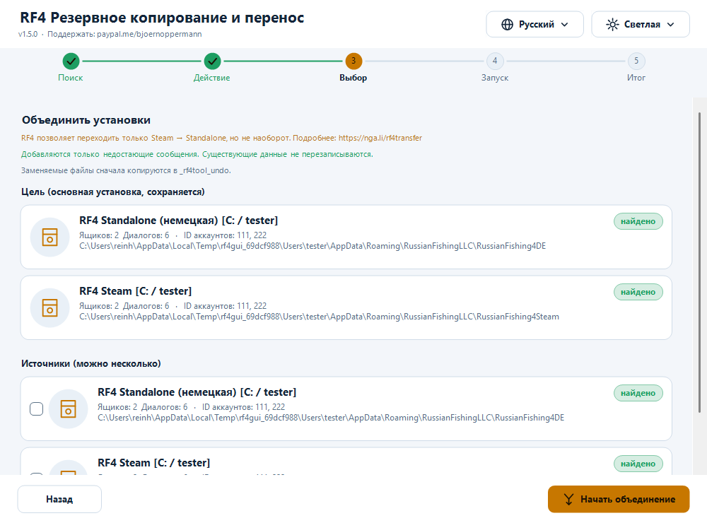

# RF4 — Резервное копирование и перенос

[Deutsch](README.md) · [English](README.en.md) · [中文](README.zh.md) · **Русский**

Бесплатная программа для **резервного копирования, восстановления, объединения и синхронизации** данных игрока *Russian Fishing 4*: игровая почта (чаты), настройки и скриншоты.
Для **Windows** (графический интерфейс + терминал, PowerShell) и **Linux/macOS** (bash).

- 🌍 **Четыре языка, полное переключение:** Deutsch · English · 中文 · Русский — новые языки добавляются обычным текстовым файлом
- 🎨 **Тёмная и светлая тема автоматически** (по настройке Windows или вручную) — новые темы тоже текстовым файлом
- 🖥️ **Чёткое изображение при любом масштабе** (100 % … 200 %, несколько мониторов)
- 🛡️ **Ничего не удаляется.** Заменяемые файлы сначала копируются в папку отмены
- 🔍 Автоматически находит **Standalone, Steam, Wine, Proton**, других пользователей и другие диски



## Быстрый старт

1. **Старый ПК:** запустите программу → **Создать резервную копию** → выберите источник → *Начать копирование*.
2. Перенесите папку копии (по умолчанию `C:\Users\<имя>\RF4_Backup`) на новый ПК (флешка, NAS, облако). Запустите там RF4 **один раз и закройте**.
3. **Новый ПК:** запустите программу → **Восстановить из копии** → выберите копию в списке → выберите целевую установку → *Начать восстановление*.

Прогресс, инвентарь и снасти хранятся на серверах RF4 и появятся сами. Программа занимается тем, что лежит **локально**: чаты, настройки, скриншоты.

## Установка

| Вариант | Как |
|---|---|
| **Установщик** `rf4sa-backup-full-setup-v1.5.0.exe` (рекомендуется) | Двойной щелчок. Создаёт пункты меню «Пуск» (GUI, терминал, **удаление**). Права администратора не нужны. |
| **Без установки** | ПКМ на `rf4sa-backup-gui.ps1` → **Выполнить с помощью PowerShell** |
| **Linux / macOS** | `bash rf4sa-backup.sh` (нужны bash ≥ 4 и `python3`) |

Для Windows нужен Windows PowerShell 5.1 (есть в Windows 10/11). Python в Windows **не нужен**. Если запуск скриптов заблокирован: `powershell -ExecutionPolicy Bypass -File rf4sa-backup-gui.ps1`.

## Графический интерфейс

Пять шагов: **Поиск → Действие → Выбор → Запуск → Итог**. Справа вверху в любой момент — **язык** (🌐) и **тема** (☀/☾); интерфейс переключается мгновенно.

- **Создать копию:** выберите источник, отметьте, что сохранять (почта, Settings.dat, Preferences.dat, Crafting.dat, скриншоты), при желании только один аккаунт, укажите папку назначения.
- **Восстановить:** в списке — все **найденные резервные копии** (стандартная папка, ранее использованные папки и их подпапки) с содержимым, размером и датой, новые сверху. «Выбрать другую папку…» — копия из другого места (например, с флешки). Всё, что есть в копии, отмечается автоматически.
- **Объединить установки:** выберите цель и один или несколько источников; добавляются только недостающие сообщения.
- **Синхронизация облако/NAS:** укажите общую папку (Nextcloud, Syncthing, NAS, USB…) и установку.
- **Итог:** ключевые цифры (добавлено сообщений, диалогов, файлов, скриншотов, пропущено, ошибок); «Показать подробности» раскрывает полный журнал.

**Тема:** по умолчанию «Автоматически (как в Windows)» — переключите Windows между светлой и тёмной темой, и программа **сразу** последует за ней, даже во время работы.
**DPI:** поддержка масштаба для каждого монитора; текст и значки рисуются нативно, а не растягиваются.

## Программа для терминала

```powershell
powershell -ExecutionPolicy Bypass -File rf4sa-backup.ps1 [-Lang de|en|zh|ru|свой]
bash rf4sa-backup.sh [-l xx]          # Linux / macOS
```

Нумерованные меню; множественный выбор: номер переключает, `a` — все, `n` — ничего, `Enter` — дальше, `0` — назад. **Восстановление** предлагает найденные копии списком. После каждого действия — сводка. Рамки ровные и с 中文 (учитывается двойная ширина); `RF4_ASCII=1` — чистый ASCII.

## Возможности подробнее

- **Объединение:** дедупликация по ID сообщения (`meta.id`), новые сообщения вставляются по времени (`meta.created`). Файл **записывается только при реальных новых сообщениях**: сначала во временный файл, оригинал заменяется после успешной проверки чтением. Оригинал заранее копируется в папку отмены.
- **Синхронизация:** (1) локально → папка синхронизации (слияние); (2) папка синхронизации → локально (слияние); (3) файлы настроек — побеждает **более новый**.
- **Папка отмены:** `<установка>\_rf4tool_undo\<дата_время>\…`. Скопируйте файл обратно, чтобы отменить изменение. Программа её никогда не удаляет.
- **Безопасность:** поиск и копирование только читают. Если RF4 запущена — предупреждение (закройте игру перед восстановлением/объединением/синхронизацией). Без доступа к сети и без телеметрии.
- RF4 официально позволяет переход только **Steam → Standalone**, но не наоборот ([nga.li/rf4transfer](https://nga.li/rf4transfer)).

## Языки и темы (добавьте свои)

Всё модульно — обычные текстовые файлы, подхватываются при запуске, пересборка не нужна.

**Язык:** скопируйте [`examples/template.lang`](examples/template.lang) в `%APPDATA%\rf4-backup\lang\pt.lang` (или в папку `lang\` рядом со скриптом; Linux: `~/.config/rf4-backup/lang/pt.lang`), задайте `@code=pt` и `@name=…`, переведите текст справа от `=`. **Недостающие строки автоматически берутся из английского**, поэтому можно перевести только часть. Оставьте плейсхолдеры `{0}`, `{1}`. Кодировка UTF-8.

**Тема:** скопируйте [`examples/template.theme`](examples/template.theme) в `%APPDATA%\rf4-backup\themes\<имя>.theme` и измените цвета `#RRGGBB`. `@base=dark|light` — какой режим Windows она замещает при «Автоматически». Незаданные цвета берутся из тёмной темы.

Встроены: **Тёмная (морская)** с тёплым янтарным акцентом и **Светлая**. Контрастность проверяется тестами.

## Где лежат данные

```
%APPDATA%\RussianFishingLLC\<вариант>\Mailbox_<ID аккаунта>\*.dat   чаты (JSON, UTF-8 с BOM)
%APPDATA%\RussianFishingLLC\<вариант>\Settings.dat | Preferences.dat | Crafting.dat
Документы\Russian Fishing 4\Screenshots
```
Варианты: `RussianFishing4DE`, `RussianFishing4DE_new`, `RussianFishing4EN`, `RussianFishing4Steam` (любые другие папки там тоже находятся). В Linux тот же путь — внутри префикса Wine/Proton.
Сама программа хранит только свои настройки: `%APPDATA%\rf4-backup\settings.json` (Linux: `~/.config/rf4-backup/settings.conf`).

## Частые вопросы

- **Установка не найдена?** RF4 должна быть запущена хотя бы раз. Проверьте, что есть `%APPDATA%\RussianFishingLLC`; иначе укажите путь вручную при восстановлении.
- **Копии нет в списке?** Список охватывает `RF4_Backup`, ранее использованные папки и один уровень ниже. Папка считается копией, если в ней есть `Mailbox_*`, один из `.dat`-файлов или папка `Screenshots`. Используйте «Выбрать другую папку…».
- **После восстановления нет чатов?** При импорте RF4 должна быть закрыта. Импортируйте снова (безопасно повторять) или верните файлы из папки отмены. Проверьте ID аккаунта.
- **В терминале квадраты?** Используйте Windows Terminal; GUI это не затрагивает.
- **Steam Cloud перезаписывает файлы?** Возможно в Steam-установках; после восстановления запустите Steam офлайн или временно отключите облако для игры.
- **Linux: нет `python3`?** `sudo apt install python3` — нужен только для слияния JSON.

## Удаление

Меню «Пуск» → *RF4 Backup Tool* → **Удалить RF4 Backup Tool** (или Параметры Windows → Приложения). Удаляются только файлы программы; вас спросят, удалять ли сохранённые **настройки** (язык, тема, папка синхронизации, ваши файлы языков/тем). **Игровые данные RF4 и ваши резервные копии не затрагиваются никогда.** Без установщика — просто удалите файлы (по желанию `%APPDATA%\rf4-backup`).

## Разработка

Исходники в `src/`; `build.ps1` собирает поставляемые файлы. Тесты: `tests/Test-Core.ps1`, `tests/Test-Cli.ps1`, `tests/Test-Gui.ps1` (`powershell -STA`), `bash tests/test-sh.sh`. Установщики: Inno Setup 6 (`installer/*.iss`).

Лицензия MIT · Поддержать: [paypal.me/bjoernoppermann](https://paypal.me/bjoernoppermann) · [Codeberg](https://codeberg.org/Natural78/rf4-backup-tool)
