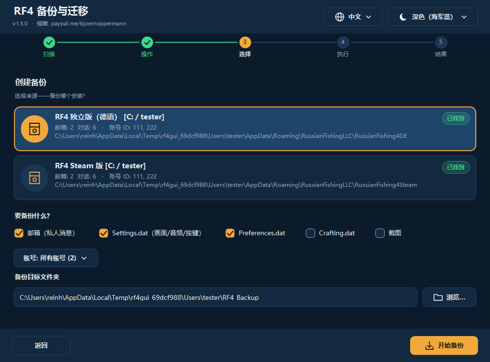

# RF4 — 备份与迁移工具

[Deutsch](README.md) · [English](README.en.md) · **中文** · [Русский](README.ru.md)

免费工具，用于**备份、恢复、合并和同步** *Russian Fishing 4* 的玩家数据：游戏内邮箱（聊天记录）、设置和截图。
支持 **Windows**（图形界面 + 终端，PowerShell）以及 **Linux/macOS**（bash）。

- 🌍 **四种语言，可随时完整切换：** 德语 · English · 中文 · Русский —— 其他语言只需添加一个文本文件
- 🎨 **深色 / 浅色自动切换**（跟随 Windows，也可手动选择）—— 其他外观同样只需一个文本文件
- 🖥️ **任何显示缩放下都清晰**（100 % … 200 %，多显示器）
- 🛡️ **绝不删除任何文件。** 被替换的文件会先复制到撤销文件夹
- 🔍 自动查找 **独立版、Steam、Wine、Proton**、其他用户和其他驱动器



## 快速开始

1. **旧电脑：** 启动程序 → **创建备份** → 选择来源 → *开始备份*。
2. 把备份文件夹（默认 `C:\Users\<用户名>\RF4_Backup`）通过 U 盘、NAS 或云盘带到新电脑，并在新电脑上**启动一次 RF4 后关闭**。
3. **新电脑：** 启动程序 → **恢复备份** → 在列表中选择备份 → 选择目标安装 → *开始恢复*。

进度、背包和渔具保存在 RF4 服务器上，会自动同步。本工具负责**本地**数据：聊天记录、设置、截图。

## 安装

| 方式 | 说明 |
|---|---|
| **安装程序** `rf4sa-backup-full-setup-v1.5.0.exe`（推荐） | 双击即可。创建开始菜单项（图形界面、终端、**卸载**）。无需管理员权限。 |
| **无需安装** | 右键 `rf4sa-backup-gui.ps1` → **使用 PowerShell 运行** |
| **Linux / macOS** | `bash rf4sa-backup.sh`（需要 bash ≥ 4 和 `python3`） |

Windows 需要 Windows PowerShell 5.1（Windows 10/11 已预装），Windows 上**不需要** Python。若脚本被阻止：`powershell -ExecutionPolicy Bypass -File rf4sa-backup-gui.ps1`。

## 图形界面

五个步骤：**扫描 → 操作 → 选择 → 执行 → 结果**。右上角随时可切换**语言**（🌐）和**外观**（☀/☾），界面立即生效。

- **创建备份：** 选择来源，勾选要保存的内容（邮箱、Settings.dat、Preferences.dat、Crafting.dat、截图），可只备份某一个账号，选择目标文件夹。
- **恢复备份：** 列表显示所有**现有备份**（默认文件夹、曾经使用过的文件夹及其子文件夹），含内容、大小和日期，最新的在前。用「选择其他文件夹…」可选择别处的备份（如 U 盘）。备份中包含的内容会自动勾选。
- **合并安装：** 选择目标和一个或多个来源，只补充缺失的消息。
- **云 / NAS 同步：** 选择共享文件夹（Nextcloud、Syncthing、NAS、U 盘……）和安装。
- **结果：** 显示关键数据（补充的消息、对话、复制的文件、截图、跳过、错误）；*显示详情* 可展开完整日志。

**外观：**默认「自动（跟随 Windows）」——在 Windows 中切换浅色/深色，程序会**立即**跟随，甚至在运行时。
**高分屏：**支持每显示器 DPI；文字和图标原生绘制，不是放大的位图。

## 终端程序

```powershell
powershell -ExecutionPolicy Bypass -File rf4sa-backup.ps1 [-Lang de|en|zh|ru|自定义]
bash rf4sa-backup.sh [-l xx]          # Linux / macOS
```

数字菜单；多选：输入数字切换，`a` = 全选，`n` = 全不选，`Enter` = 继续，`0` = 返回。**恢复**会以列表显示现有备份。每次操作后显示摘要。边框考虑了中文的双倍宽度，对齐整齐；`RF4_ASCII=1` 为纯 ASCII。建议使用 **Windows Terminal** 显示中文。

## 功能详解

- **合并：** 按消息 ID（`meta.id`）去重，按时间（`meta.created`）排序插入。只有**确实有新消息**时才写文件，先写临时文件并回读校验成功后才替换原文件；原文件会先复制到撤销文件夹。
- **同步：** (1) 本地 → 同步文件夹（合并）；(2) 同步文件夹 → 本地（合并）；(3) 设置文件以**较新**的为准。
- **撤销文件夹：** `<安装>\_rf4tool_undo\<日期_时间>\…`。把文件复制回去即可撤销。程序绝不会删除它。
- **安全：** 扫描和备份只读取。RF4 正在运行时会警告（恢复/合并/同步前请先关闭游戏）。无网络访问，无遥测。
- RF4 官方只允许 **Steam → 独立版**，不允许反向（[nga.li/rf4transfer](https://nga.li/rf4transfer)）。

## 语言和外观（可自行添加）

一切都是模块化的——纯文本文件，启动时自动识别，无需重新编译。

**语言：**把 [`examples/template.lang`](examples/template.lang) 复制到 `%APPDATA%\rf4-backup\lang\pt.lang`（或脚本旁的 `lang\` 文件夹；Linux：`~/.config/rf4-backup/lang/pt.lang`），设置 `@code=pt` 和 `@name=…`，翻译 `=` 右边的文字。**缺少的行会自动回退到英语**，所以可以只翻译一部分。请保留占位符 `{0}`、`{1}`。文件编码 UTF-8。

**外观：**把 [`examples/template.theme`](examples/template.theme) 复制到 `%APPDATA%\rf4-backup\themes\<名称>.theme` 并修改 `#RRGGBB` 颜色。`@base=dark|light` 表示在「自动」模式下它代表哪种 Windows 模式。未设置的颜色取自深色外观。

内置：**深色（海军蓝）**配暖琥珀色强调色，以及**浅色**。对比度由测试验证。

## 数据位置

```
%APPDATA%\RussianFishingLLC\<版本>\Mailbox_<账号ID>\*.dat      聊天（JSON，UTF-8 带 BOM）
%APPDATA%\RussianFishingLLC\<版本>\Settings.dat | Preferences.dat | Crafting.dat
文档\Russian Fishing 4\Screenshots
```
版本：`RussianFishing4DE`、`RussianFishing4DE_new`、`RussianFishing4EN`、`RussianFishing4Steam`（该目录下的其他文件夹也会被自动识别）。Linux 下相同路径位于 Wine/Proton 前缀内。
本工具自身只保存设置：`%APPDATA%\rf4-backup\settings.json`（Linux：`~/.config/rf4-backup/settings.conf`）。

## 常见问题

- **未找到安装？** RF4 必须至少启动过一次。检查 `%APPDATA%\RussianFishingLLC` 是否存在；否则在恢复时手动选择目标路径。
- **备份不在列表中？** 列表涵盖 `RF4_Backup`、曾用文件夹及其下一级。文件夹含有 `Mailbox_*`、`.dat` 文件或 `Screenshots` 即视为备份。可用「选择其他文件夹…」。
- **恢复后没有聊天记录？** 导入时 RF4 必须已关闭。可重新导入（可重复执行）或从撤销文件夹复制回来。请核对账号 ID。
- **终端显示方框？** 请使用 Windows Terminal；图形界面不受影响。
- **Steam 云覆盖文件？** Steam 安装可能出现；恢复后请离线启动 Steam，或暂时关闭该游戏的云同步。
- **Linux 没有 `python3`？** `sudo apt install python3` —— 仅用于合并 JSON。

## 卸载

开始菜单 → *RF4 Backup Tool* → **卸载 RF4 Backup Tool**（或 Windows 设置 → 应用）。只会删除程序文件，并询问是否一并删除保存的**设置**（语言、外观、同步文件夹、您自己的语言/外观文件）。**您的 RF4 游戏数据和备份绝不会被触碰。**不用安装程序时：直接删除文件（可选删除 `%APPDATA%\rf4-backup`）。

## 开发

源码在 `src/`；`build.ps1` 生成发布的单文件。测试：`tests/Test-Core.ps1`、`tests/Test-Cli.ps1`、`tests/Test-Gui.ps1`（`powershell -STA`）、`bash tests/test-sh.sh`。安装程序：Inno Setup 6（`installer/*.iss`）。

MIT 许可证 · 捐赠：[paypal.me/bjoernoppermann](https://paypal.me/bjoernoppermann) · [Codeberg](https://codeberg.org/Natural78/rf4-backup-tool)
