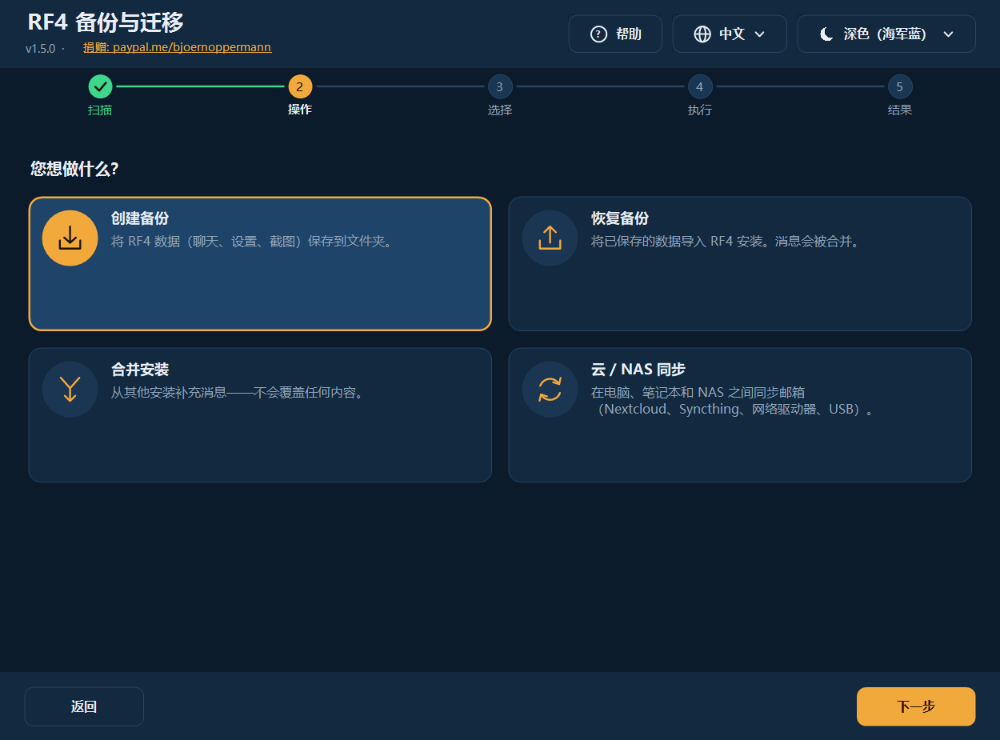
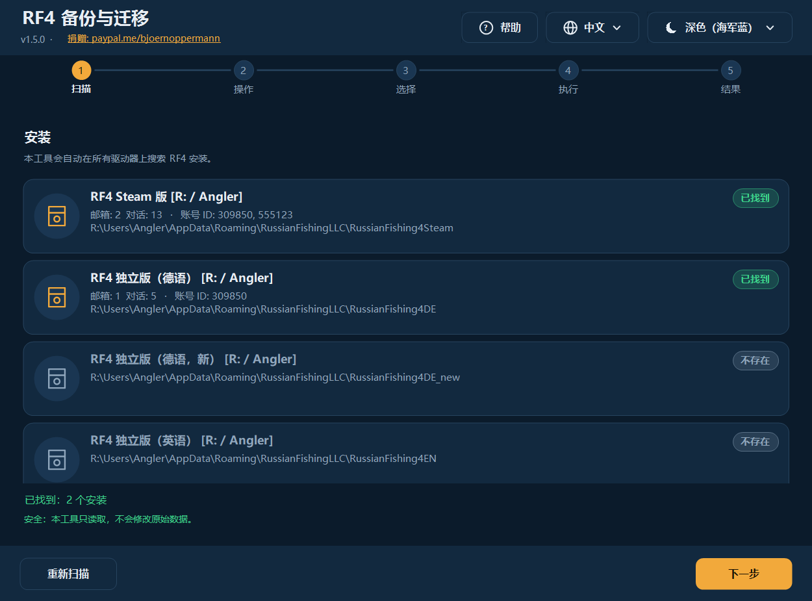
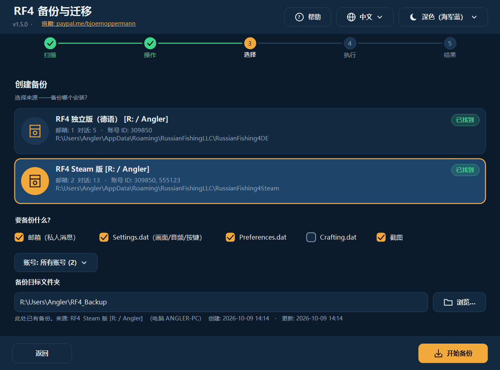
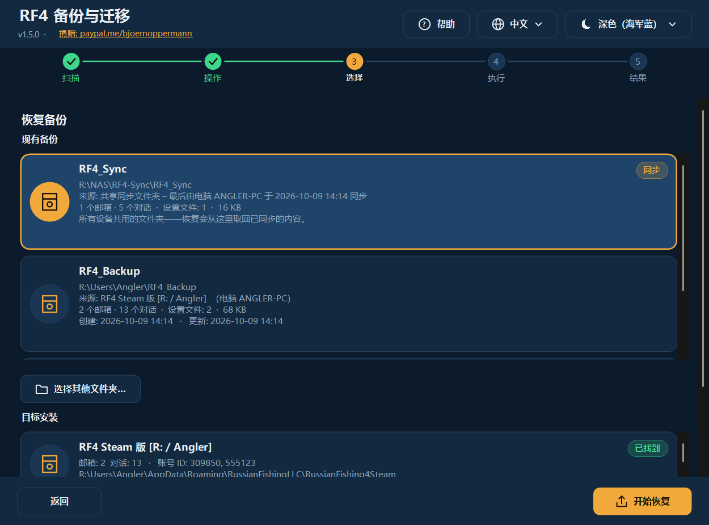
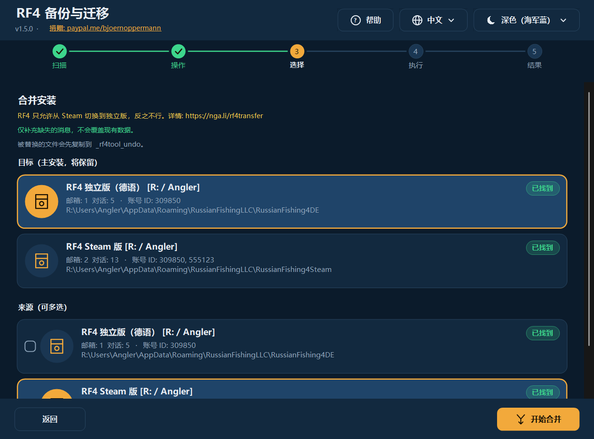
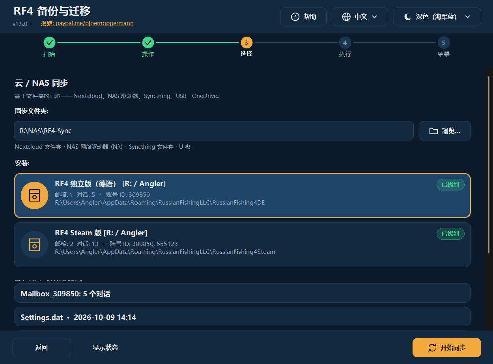
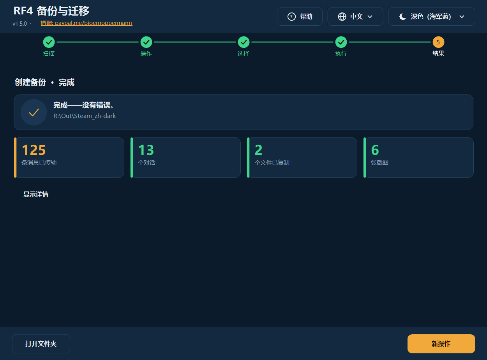
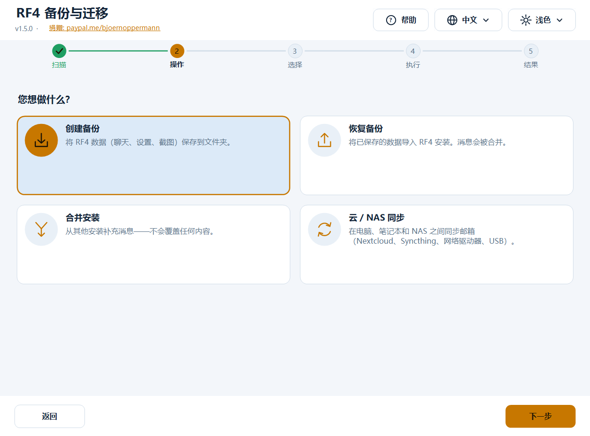
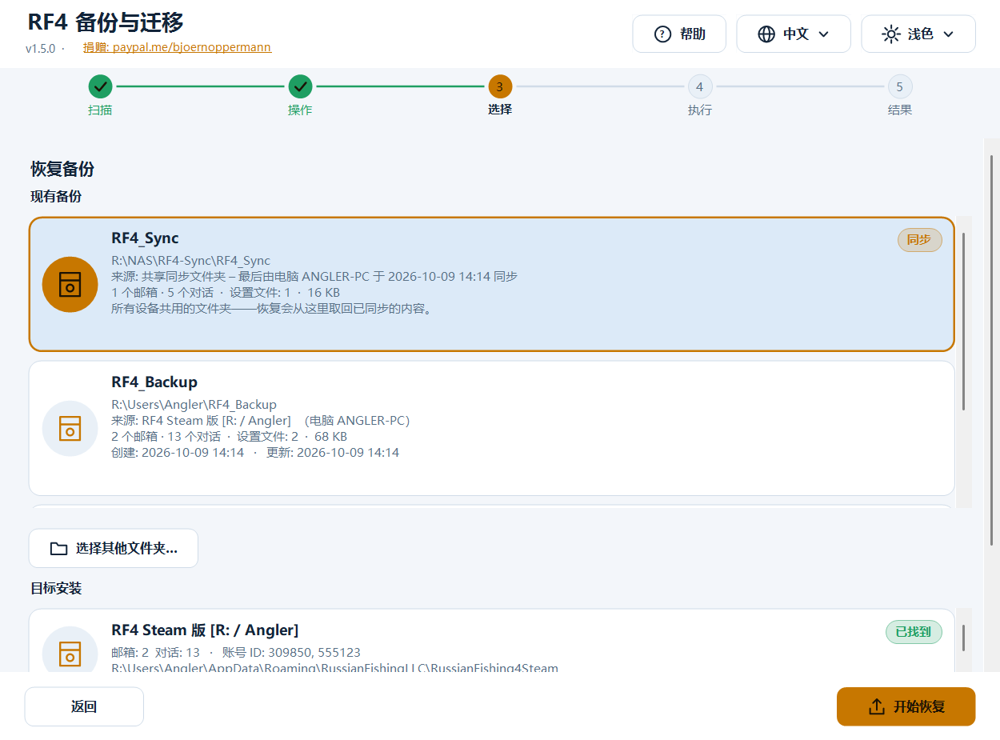
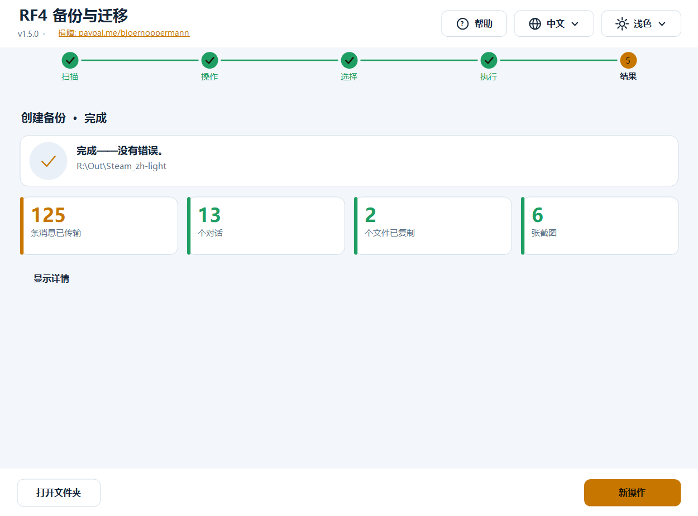

# RF4 — 备份与迁移工具

[Deutsch](README.md) · [English](README.en.md) · **中文** · [Русский](README.ru.md)

免费工具，用于**备份、恢复、合并和同步** *Russian Fishing 4* 的玩家数据：游戏内邮箱（聊天记录）、设置和截图。
支持 **Windows**（图形界面 + 终端，PowerShell）以及 **Linux/macOS**（bash）。

- 🌍 **四种语言，可随时完整切换：** Deutsch · English · 中文 · Русский —— 其他语言只需添加一个文本文件
- 🎨 **深色 / 浅色自动切换**（跟随 Windows，也可手动选择）—— 其他外观同样只需一个文本文件
- 🖥️ **任何显示缩放下都清晰**（100 % … 200 %，多显示器）
- 🛡️ **绝不删除任何文件。** 被替换的文件会先复制到撤销文件夹
- 🔍 自动查找 **独立版、Steam、Wine、Proton**、其他用户和其他驱动器
- 📍 每个备份都记录**来自哪个安装、何时创建**；也可以**从同步文件夹 / NAS 恢复**
- ❓ **帮助按钮**会用程序当前的语言打开本指南（带截图）



📄 指南与博客：[nga.li/rf4b](https://nga.li/rf4b) · 📥 下载：[nga.li/rf4dl](https://nga.li/rf4dl) · 💻 源代码：[nga.li/rf4git](https://nga.li/rf4git)

---

## 目录

1. [快速开始](#快速开始)
2. [安装](#安装)
3. [图形界面](#图形界面)
4. [终端程序](#终端程序)
5. [功能详解](#功能详解)
6. [语言和外观（可自行添加）](#语言和外观)
7. [数据位置](#数据位置)
8. [安全与验证](#安全与验证)
9. [常见问题与故障排除](#常见问题与故障排除)
10. [卸载](#卸载)
11. [设置与环境变量](#设置与环境变量)
12. [开发、测试、构建](#开发测试构建)
13. [更新日志](#更新日志)

---

## 快速开始

**换电脑或重装系统，三步搞定：**

1. **旧电脑：** 启动程序 → **创建备份** → 选择来源 → *开始备份*。
2. 把备份文件夹（默认 `Users\<用户名>\RF4_Backup`）通过 U 盘、NAS 或云盘带到新电脑，并在新电脑上**启动一次 RF4 后关闭**。
3. **新电脑：** 启动程序 → **恢复备份** → 在列表中选择备份 → 选择目标安装 → *开始恢复*。

进度、背包和渔具保存在 RF4 服务器上，在新电脑上会自动出现。本工具负责**本地**数据：聊天记录、设置、截图。

---

## 安装

| 方式 | 适用 | 做法 |
|---|---|---|
| **安装程序**（`rf4sa-backup-full-setup-v1.5.0.exe`） | Windows，推荐 | 双击，下一步，完成。创建开始菜单项（图形界面、终端、**带截图的指南**、**卸载**），并带有一个**可点击链接**页面（捐赠、博客、下载、源代码）。无需管理员权限。 |
| `rf4sa-backup-gui-setup-v1.5.0.exe` / `rf4sa-backup-cli-setup-v1.5.0.exe` | 仅图形界面 / 仅终端 | 同上 |
| **无需安装** | Windows | 右键 `rf4sa-backup-gui-v1.5.0.ps1` → **使用 PowerShell 运行** |
| **Linux / macOS** | bash | `bash rf4sa-backup-v1.5.0.sh`（需要 bash ≥ 4 和 `python3`） |

所有程序文件的名称中都带有**版本号**（`rf4sa-backup-gui-v1.5.0.ps1`、`rf4sa-backup-v1.5.0.ps1`、`rf4sa-backup-v1.5.0.sh`），与安装程序一致。更新时安装程序会替换旧文件。
Windows 要求：Windows PowerShell 5.1（Windows 10/11 已预装；Windows 7 需 WMF 5.1）。Windows 上**不需要** Python。

> **提示“已禁用脚本执行”：** 右键启动时，Windows 会为这一次启动自动设置执行策略。如果仍然出现提示：
> `powershell -ExecutionPolicy Bypass -File rf4sa-backup-gui-v1.5.0.ps1`

---

## 图形界面

分步引导，顶部有五个步骤：**扫描 → 操作 → 选择 → 执行 → 结果**。
右上角随时可用**帮助**（❓）、**语言**（🌐）和**外观**（☀/☾），界面立即切换，无需重启。**帮助按钮**会离线在浏览器中打开本指南——**使用程序当前设置的语言**，并附带相应语言的截图。

### 1. 扫描
程序会查找所有 RF4 安装：当前用户、其他用户、所有驱动器。已找到的会标出，可能的（尚不存在的）目标显示为灰色。列表可滚动（鼠标滚轮，也可直接在条目上滚动）。



### 2. 操作
四张卡片：创建备份 · 恢复备份 · 合并安装 · 云 / NAS 同步。


### 3. 选择

**创建备份：** 选择来源，勾选要保存的内容（邮箱、Settings.dat、Preferences.dat、Crafting.dat、截图），有多个账号时可只备份*一个*账号，选择目标文件夹。如果该文件夹中已有备份，会显示其来源和日期提示。



**恢复备份：** 顶部列出所有**现有备份**，含内容、大小、**来源**（哪个安装、哪台电脑）和**日期**（创建/更新），最新的在前。列表包括默认文件夹、曾经使用过的文件夹及其子文件夹，以及**同步文件夹**（标记为 *同步*）。用「选择其他文件夹…」可选择别处的备份（U 盘、**网络驱动器/NAS**）；也可以选择同步文件夹的**上一级**文件夹（程序会自己找到其中的 `RF4_Sync`）。然后选择目标安装；备份中包含的内容会自动勾选。



**合并：** 选择目标（主安装）并勾选一个或多个来源。只补充缺失的消息。



**云 / NAS 同步：** 输入同步文件夹（Nextcloud、Syncthing、NAS 驱动器、U 盘……），选择安装，*开始同步*。*显示状态* 会列出同步文件夹中已有的内容。



### 4./5. 执行与结果
处理过程中，进度条显示当前行。完成后显示**关键数据**（传输的消息、对话、复制的文件、截图、跳过、错误）。*显示详情* 展开完整日志；*打开文件夹* 在资源管理器中打开目标。



### 浅色与深色

**外观：** 默认为「自动（跟随 Windows）」——在 Windows 中切换浅色/深色模式，程序会**立即**跟随（甚至在运行时）。也可以固定选择一个外观。





**语言：** 首次启动时按 Windows 语言，否则为英语；您的选择会被保存。
**键盘：** `Tab` 在卡片/按钮之间切换，`空格`/`Enter` 选择。
**高分屏：** 程序支持每显示器 DPI（Per-Monitor v2）——文字和图标原生绘制，不是放大的位图。把窗口移到另一台显示器时会自动适应。

---

## 终端程序

```powershell
powershell -ExecutionPolicy Bypass -File rf4sa-backup-v1.5.0.ps1            # 自动选择语言
powershell -ExecutionPolicy Bypass -File rf4sa-backup-v1.5.0.ps1 -Lang zh   # 固定：de | en | zh | ru | 自定义
```

```
  ╔════════════════════════════════════════════════════════════╗
  ║ RF4 备份与迁移   v1.5.0                                    ║
  ║ RF4: nga.li/rf4de  ·  Blog: nga.li/rf4b                    ║
  ║ 捐赠: paypal.me/bjoernoppermann                            ║
  ╚════════════════════════════════════════════════════════════╝

   [1] 扫描 – 显示所有安装
   [2] 备份 – 将数据保存到文件夹
   [3] 恢复 – 从备份导入
   [4] 合并 – 合并多个安装
   [5] 同步 – 与云/NAS同步
   [H] 帮助 / 指南
   [L] 切换语言  (中文)
   [0] 退出
```

- 菜单：输入数字。多选：输入数字切换（`1 3 4` 或 `1,3`），`a` = 全选，`n` = 全不选，`Enter` = 继续，`0` = 返回。
- **`[H]`** 用程序当前语言打开指南（带截图的 HTML）。
- **恢复**会以列表显示现有备份（含路径、来源、内容、日期；同步文件夹标有 `[同步]`），也可手动输入路径——UNC 路径如 `\\NAS\rf4\RF4_Sync` 同样可用。
- 每次操作后显示带关键数据的**摘要**。
- 边框和符号为 Unicode，即使使用中文也能对齐（考虑了双倍宽度）。`RF4_ASCII=1` 为纯 ASCII（用于旧控制台/日志）。
- 显示中文请使用 **Windows Terminal**（经典控制台视字体可能显示为方框）。

**Linux / macOS：**

```bash
bash rf4sa-backup-v1.5.0.sh            # 按 LANG 自动选择语言，或：
bash rf4sa-backup-v1.5.0.sh -l ru
```

可识别：Windows 分区（`/mnt/*`、`/run/media/*/*`）、Wine 前缀（`~/.wine`、`~/.local/share/wineprefixes/*`、Lutris）、Steam Proton（`…/steamapps/compatdata/*`，包括 Flatpak）。菜单与 Windows 相同（`[H]` 通过 `xdg-open`/`open` 打开指南）。

---

## 功能详解

### 备份什么？
| 项目 | 内容 |
|---|---|
| **邮箱** | 游戏内聊天（`Mailbox_<账号ID>\*.dat`，JSON）。保存在本地，不在 RF4 服务器上。 |
| **Settings.dat** | 画面、音频、按键设置 |
| **Preferences.dat** | 其他游戏设置 |
| **Crafting.dat** | 制作数据 |
| **截图** | `文档\Russian Fishing 4\Screenshots`（包括子文件夹；已有的同名文件绝不覆盖） |

### 备份
把所选内容复制到目标文件夹。邮箱会被**合并**而不是盲目覆盖——因此备份到已有文件夹就是*增量*备份。设置文件不同时，程序会先询问。
程序会在备份文件夹中创建 `rf4-backup.info`：**来源**（安装、版本、电脑名、用户）、**创建**、**更新**以及最近几次备份的简短历史。之后在恢复列表（图形界面、终端、bash）中就能看出备份来自哪里、有多新。该文件是纯文本，各平台都可读取。

### 恢复
把备份导入某个安装（也可导入空的新安装）。消息会被合并，设置文件只有在确认后才会被替换。如果 **RF4 仍在运行**，程序会发出警告（只有游戏进程 `rf4_x64`/`rf4_x32` 算数——打开的启动器或安装程序不会触发警告）。请先关闭游戏，否则游戏退出时会覆盖您的更改。

**从同步文件夹 / NAS / 网络驱动器恢复：**
- 已配置的**同步文件夹**会自动出现在备份列表中（标记为 *同步*，来源：“最后由电脑 … 于 … 同步”）——直接点击即可。
- 或者用「选择其他文件夹…」导航到那里：同步文件夹、**其上一级文件夹**或备份文件夹。程序会自己识别所选文件夹中的 `RF4_Sync`。
- 网络驱动器必须已连接。提示：盘符只在连接它的 Windows 会话中有效——“以管理员身份运行”或在其他会话中，最好使用 **UNC 路径**（`\\NAS\共享\…`）。
- 如果程序在那里什么也没找到，会明确告知（“未找到备份，RF4_Sync 子文件夹中也没有”），而不是悄悄失败。

### 合并
把目标安装中缺失的所有消息补充进去：

1. 每条消息都有唯一 ID（`meta.id`）。按 ID **去重**——不会出现重复。
2. 新消息按时间（`meta.created`）插入。
3. **只有确实有新消息时才写文件。** 先写入临时文件，回读校验（JSON 可再次读取）成功后才替换原文件。
4. 原文件会先复制到撤销文件夹。

典型场景：Steam → 独立版、Steam → Steam（新电脑）、独立版 → 独立版、多个旧安装 → 一个新安装。
> RF4 官方只允许 **Steam → 独立版**，不允许反向。详情：[nga.li/rf4transfer](https://nga.li/rf4transfer)

### 云 / NAS 同步
通过共享文件夹（子文件夹 `RF4_Sync`）双向同步：

1. **本地 → 同步：** 新消息合并到同步文件夹。
2. **同步 → 本地：** 同步文件夹中的新消息（来自其他设备）在本地合并。
3. **设置文件：** 以**较新**的文件（时间戳）为准；相同则不做处理。

在每台设备上使用同一个文件夹。支持 Nextcloud、Syncthing、OneDrive、网络驱动器（包括 OpenMediaVault/OMV 共享）、U 盘。`RF4_Sync\.sync_log` 记录了哪台设备最后一次同步以及时间。

### 撤销文件夹
恢复、合并和同步时，**每个将被替换的文件都会先复制**到：

```
<安装>\_rf4tool_undo\<日期_时间>\<文件夹>\<文件>
```

要撤销更改，把文件从那里复制回去即可。该文件夹不会影响 RF4；您可以随时自行删除。程序绝不会删除它。

---

## 语言和外观

一切都是**模块化**的：语言和外观是简单的文本文件。四种语言和两种外观已内置；其他的会在启动时自动识别——无需重新编译。

### 添加自己的语言
1. 把模板 [`examples/template.lang`](examples/template.lang) 复制到  
   `%APPDATA%\rf4-backup\lang\pt.lang`（或脚本**旁边**的 `lang\` 文件夹；Linux：`~/.config/rf4-backup/lang/pt.lang`）。
2. 在顶部设置 `@code=pt` 和 `@name=Português`，翻译 `=` 右边的文字。**缺少的行会自动回退到英语**——所以也可以只翻译一部分。
3. 重启程序：该语言会出现在语言菜单中（如果与 Windows 语言匹配，甚至会被自动选用）。

占位符 `{0}`、`{1}` 必须保留在文本中（它们会被名称/数字替换）。文件编码：UTF-8。**指南**（帮助按钮）提供四种内置语言版本；自定义语言会打开英文版。

```ini
@code=pt
@name=Português
app_title=RF4 Cópia e Migração
menu_backup=Cópia – guardar dados
```

### 添加自己的外观
把模板 [`examples/template.theme`](examples/template.theme) 复制到 `%APPDATA%\rf4-backup\themes\<名称>.theme` 并修改颜色（`#RRGGBB`）。`@base=dark|light` 表示在「自动」模式下它代表哪种 Windows 模式。未设置的颜色取自深色外观。它会出现在外观菜单中。

### 内置
| 外观 | 说明 |
|---|---|
| **深色（海军蓝）** | 深海军蓝，暖琥珀色强调色 |
| **浅色** | 浅蓝灰，较深的琥珀色（已验证对比度） |

对比度（文字/背景 ≥ 7:1，按钮 ≥ 4.5:1）由测试验证。

---

## 数据位置

```
%APPDATA%\RussianFishingLLC\<版本>\Mailbox_<账号ID>\*.dat      聊天（JSON，UTF-8 带 BOM）
%APPDATA%\RussianFishingLLC\<版本>\Settings.dat | Preferences.dat | Crafting.dat
文档\Russian Fishing 4\Screenshots
```

| 文件夹名 | 含义 |
|---|---|
| `RussianFishing4DE` | RF4 独立版（德语） |
| `RussianFishing4DE_new` | RF4 独立版（德语，新） |
| `RussianFishing4EN` | RF4 独立版（英语） |
| `RussianFishing4Steam` | RF4 Steam 版 |
| *（该目录下的其他文件夹）* | 自动识别 |

Linux 下相同路径位于相应的 Wine/Proton 前缀内（`…/drive_c/users/<名称>/AppData/Roaming/RussianFishingLLC/…`）。

**本工具自身保存**（只有设置，没有游戏数据）：`%APPDATA%\rf4-backup\settings.json`（语言、外观、同步文件夹、最近使用的备份文件夹）或 `~/.config/rf4-backup/settings.conf`；发生意外错误时，同一文件夹中还有 `error.log`。

---

## 安全与验证

- **绝不删除任何文件**——不删除游戏数据、备份或撤销文件夹。
- 扫描和备份只从安装中**读取**。
- 写入操作（恢复/合并/同步）会先把被替换的文件复制到撤销文件夹；消息文件以原子方式写入并回读校验，且只在确有变化时写入。
- 恢复/合并/同步前会检查 RF4 是否在运行（警告）。
- 意外错误不会让程序崩溃：它会显示提示，并把详情写入 `%APPDATA%\rf4-backup\error.log`。
- 无网络访问（除了您自己指定的同步/备份文件夹），无遥测。源代码完全可读（发布的 `.ps1`/`.sh` 文件就是代码）。

**校验和：** 见 [CHECKSUMS.txt](CHECKSUMS.txt)。
```powershell
Get-FileHash .\rf4sa-backup-gui-v1.5.0.ps1 -Algorithm SHA256        # Windows
```
```bash
sha256sum rf4sa-backup-v1.5.0.sh                                     # Linux
```
首次启动前，请将哈希值与 `CHECKSUMS.txt`（或 [nga.li/rf4dl](https://nga.li/rf4dl) 上的值）比较。

---

## 常见问题与故障排除

**“未找到安装”**
RF4 必须至少启动过**一次**（那时它会创建数据文件夹）。检查 `%APPDATA%\RussianFishingLLC` 是否存在。其他驱动器上的安装，只要那里有 `Users` 文件夹就能找到；否则在恢复时*手动*选择目标路径。

**我的备份不在列表中**
列表显示默认文件夹 `RF4_Backup`、曾经使用过的文件夹、同步文件夹以及它们的下一级。文件夹含有 `Mailbox_*` 文件夹、某个 `.dat` 文件或 `Screenshots` 文件夹即视为备份。其他位置请用「选择其他文件夹…」。

**从 NAS / 同步文件夹恢复不成功**
检查驱动器是否已连接且可访问（资源管理器）。以“管理员身份”启动时，程序看不到普通会话中的网络驱动器——请使用 UNC 路径。可以选择同步文件夹本身、其上一级文件夹，或列表中标记为 *同步* 的条目。如果仍提示“未找到备份”，说明该文件夹（尚）没有 `Mailbox_*` 数据：请先在某台设备上执行一次*同步*。

**恢复后看不到聊天记录**
导入时 RF4 必须已关闭。可重新导入（可重复执行）或从撤销文件夹复制回来。另外请核对账号 ID：聊天记录位于您账号的 ID 下（`Mailbox_<ID>`）。

**只开了启动器却出现“RF4 正在运行”警告**
现在不应再发生：只有 `rf4_x64`/`rf4_x32` 算数。如果仍出现，说明游戏还在后台运行（任务管理器）。

**列表没有显示所有条目**
列表可以滚动：鼠标滚轮（也可直接在条目上滚动）或右侧的滚动条。窗口可以放大。

**“无法运行脚本”**
`powershell -ExecutionPolicy Bypass -File <文件>`；对于下载的文件，可能需要右键 → 属性 → *解除锁定*。

**终端中中文 / Русский 显示为方框**
请使用 Windows Terminal 或带有 CJK/西里尔字符的字体。图形界面不受影响。

**图形界面对我的屏幕太大**
起始大小会根据屏幕调整；窗口可以改变大小，空间不足时内容可滚动。

**Steam 云会覆盖文件吗？**
如果为 RF4 启用了 Steam 云，Steam 安装中可能发生。恢复后请离线启动 Steam，或暂时关闭该游戏的云同步。

**Linux：缺少 `python3`**
`sudo apt install python3`（Debian/Ubuntu）。Python 仅用于合并 JSON 文件。

---

## 卸载

- **安装程序版本：** 开始菜单 → *RF4 Backup Tool* → **卸载 RF4 Backup Tool**（或 Windows 设置 → 应用）。卸载程序只会删除程序文件，并询问是否一并删除保存的**设置**（语言、外观、同步文件夹、您自己的语言/外观文件）。**您的 RF4 游戏数据和备份绝不会被触碰。**
- **无安装程序：** 直接删除文件即可。可选删除文件夹 `%APPDATA%\rf4-backup`（Linux：`~/.config/rf4-backup`）。

---

## 设置与环境变量

| 变量 | 作用 |
|---|---|
| `RF4_LANG=xx` | 设置语言（de、en、zh、ru 或自定义） |
| `RF4_ASCII=1` | 终端：纯 ASCII 显示 |
| `RF4_BACKUP_DIRS=a;b`（Linux：`a:b`） | 额外搜索备份的文件夹 |
| `RF4_SCAN_USERS=a;b`（Linux：`a:b`） | 额外搜索安装的“Users”文件夹 |
| `RF4_NO_DRIVE_SCAN=1` | 不搜索所有驱动器 |
| `RF4_THEME_BASE=dark\|light` | 强制“自动”使用的 Windows 模式（测试） |
| `RF4_GUI_SCALE=1.5` | 强制图形界面缩放（测试/截图） |
| `RF4_FAKE_RUNNING=rf4_x64` | 模拟游戏正在运行（测试） |

---

## 开发、测试、构建

源代码位于 `src/`：

| 文件 | 内容 |
|---|---|
| `core.ps1` | 共用逻辑（扫描、合并、备份/恢复、同步、查找备份、备份信息、统计、配置、加载语言/外观、打开帮助） |
| `lang/*.lang` | 所有文字（每种语言一个文件） |
| `themes/*.theme` | 颜色（每种外观一个文件） |
| `ui.cs` | 自绘图形界面组件（按钮、卡片、进度、步骤条……），支持 DPI |
| `gui.ps1`、`cli.ps1` | 界面 |
| `cli.sh` | Linux/macOS 脚本 |

`build.ps1` 会生成发布的单文件，**文件名带版本号**（语言、外观和 C# 代码被嵌入；bash 的语言表由 `.lang` 文件生成——**所有平台共用一个来源**），并生成 HTML 指南（`docs/guide.<语言>.html`，由四个 README 生成，带截图）。

```powershell
powershell -ExecutionPolicy Bypass -File build.ps1
powershell -ExecutionPolicy Bypass -File tests\Test-Core.ps1 [-RealDataDir <邮箱文件夹>]   # 逻辑、语言/外观、对比度、合并、同步、备份信息
powershell -ExecutionPolicy Bypass -File tests\Test-Cli.ps1                                # 终端：所有语言、边框宽度、流程
powershell -STA -ExecutionPolicy Bypass -File tests\Test-Gui.ps1                           # 图形界面：面板 × 外观 × 语言 × 缩放、溢出、对话框、滚轮
powershell -STA -ExecutionPolicy Bypass -File tests\Test-RealFlow.ps1                      # 在真实用户配置中的假安装上，用真实对话框测试所有功能
bash tests/test-sh.sh                                                                      # Linux 脚本
powershell -STA -ExecutionPolicy Bypass -File tools\make-screenshots.ps1                   # 为指南生成截图（每种语言，演示数据）
```

**用真实感数据安全测试：** `tools\fake-installs.ps1 -Create` 会基于真实安装创建假安装 `RussianFishing4TEST_A/_B/_C`（对话部分重叠、第二个账号、设置不同）；`-Remove` 只删除带标记文件的假安装。原始安装绝不会被修改。

新增文字：把键添加到**所有** `src/lang/*.lang`（测试会检查每个键在每种内置语言中都存在且占位符一致；`tools\add-lang-keys.ps1` 可帮忙），然后运行 `build.ps1`。
修改指南：在**全部四个** README 中同步修改（相同的章节/图片），然后运行 `build.ps1` 和 `tools\make-screenshots.ps1`。
安装程序：用 [Inno Setup 6](https://jrsoftware.org/isinfo.php) 编译 `installer/*.iss`（`ISCC.exe installer\rf4sa-backup-full.iss`）。

---

## 更新日志

**1.5.0**
- **全新界面：** 完全重新绘制，任何 DPI 下都清晰，深色/浅色**自动**跟随 Windows，顶部有帮助/语言/外观菜单，用卡片代替列表，步骤条、进度条、带关键数据的结果。底部的日志窗口已取消（详情可展开）。
- 恢复界面（图形界面、终端、bash）列出**现有备份**，含**来源和日期**（`rf4-backup.info`）；使用过的文件夹会被记住。**从同步文件夹/NAS 恢复**可从列表或通过（上一级）文件夹进行。
- **程序语言的帮助：** 帮助按钮（图形界面）、`[H]`（终端/bash）和开始菜单会打开 HTML 指南，并附带**与语言一致的截图**；四种语言版本内容完全相同。
- **模块化：** 语言为 `lang/*.lang`，外观为 `themes/*.theme`——自己的文件会被自动识别。
- **文件名带版本号**（`rf4sa-backup-gui-v1.5.0.ps1` ……），安装程序会替换旧文件。
- **安装程序：** 开始菜单项包括指南和卸载，可点击的链接，卸载时询问是否删除保存的设置。
- **修复：** 消息对话框（例如“RF4 正在运行”）会因 .NET 错误崩溃并中断恢复/合并/同步；打开的启动器会误触发警告；鼠标滚轮无法滚动列表；恢复时无法识别同步文件夹的上一级。
- **终端和 bash：** 边框/符号（兼顾 CJK 宽度）、彩色摘要、ASCII 回退。
- 超过 380 项自动化检查（逻辑、终端、图形界面、带真实对话框的真实数据流程、Linux），包括外观的对比度检查。

**1.4.0** 共用核心、完整翻译（DE/EN/ZH/RU）、修复（从未找到自己的安装、单个文件导致崩溃、恢复时的截图）、撤销文件夹、RF4 运行时警告。
**1.3.0** i18n（仅菜单）、Inno Setup 安装程序 · **1.2.0** 云/NAS 同步 · **1.1.x** 账号 ID、多来源合并 · **1.0.0** 首次发布

---

## 链接与许可

| | |
|---|---|
| RF4 官方（德语 / 英语） | [nga.li/rf4de](https://nga.li/rf4de) · [nga.li/rf4en](https://nga.li/rf4en) |
| Steam 上的 RF4 | [nga.li/rf4steam](https://nga.li/rf4steam) |
| Steam → 独立版迁移 | [nga.li/rf4transfer](https://nga.li/rf4transfer) |
| 论坛 | [nga.li/rf4forum](https://nga.li/rf4forum) |
| 文章与指南 | [nga.li/rf4b](https://nga.li/rf4b) |
| 源代码（Codeberg） | [codeberg.org/Natural78/rf4-backup-tool](https://codeberg.org/Natural78/rf4-backup-tool) |

MIT 许可证——可自由使用、修改和分发。如果您喜欢这个工具：[paypal.me/bjoernoppermann](https://paypal.me/bjoernoppermann) ☕
